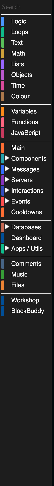

# Using Blocks

Every feature your bot has is built out of blocks. This page explains how blocks work, what the different shapes mean, and how to find the one you need. Each category in the toolbox then has its own page in this section.

## The toolbox

The toolbox is the column down the left side of the editor. Click a category and its blocks slide out in a panel called the **flyout**. Drag a block from the flyout onto the canvas to use it.

The categories are grouped, with a thin line between each group:

| Group | Categories | What they are for |
| --- | --- | --- |
| Language basics | Logic, Loops, Text, Math, Lists, Objects, Time, Colour | The general purpose building blocks any program needs |
| Your own code | Variables, Functions, JavaScript | Storing values, reusing logic, and dropping down to raw code |
| Discord | Main, Components, Messages, Servers, Interactions, Events, Cooldowns | Everything that talks to Discord |
| Storage and integrations | Databases, Dashboard, Apps / Utils | Remembering things, and talking to other services |
| Extras | Comments, Music, Files | Notes in your code, song lyrics, and reading and writing files |
| Installed | Workshop, BlockBuddy | Blocks other people made, and blocks you generated |

Some categories have subcategories. Click the arrow next to **Components**, **Messages**, **Servers**, **Interactions**, **Events**, **Databases** or **Apps / Utils** to open them.

:::info
The **Interactions** category has its own section in these docs, because slash commands, context menus and modals each need more than a block list. See [Interactions](../Interactions/interactions.md).
:::

## Block shapes

The shape of a block tells you where it can go. You cannot snap a block into a place it does not belong, so if a block refuses to connect, the shape is the reason.

| Shape | Name | What it does |
| --- | --- | --- |
|  | **Event block** | Sits at the top of a stack and runs everything inside it when something happens. |
|  | **Action block** | Does something. Stacks above and below other action blocks. |
|  | **Value block** | Produces a value. Plugs into a hole in another block. |
|  | **Boolean block** | Produces true or false. Plugs into the pointed holes, like the one in `if`. |

## Types

Value blocks produce a specific **type**, and holes only accept the types they understand. A block that produces a `member` will not fit in a hole that wants a `channel`. This is deliberate: it stops whole classes of mistake before you ever run the bot.

The types you will meet most often:

`String` (text), `Number`, `Boolean` (true or false), `Array` (a list), `object`, `date`, and the Discord types `user`, `member`, `server`, `channel`, `role`, `message`, `emoji`, `sticker`, `invite`, `webhook`.

:::tip
Hover over any block to see a tooltip listing the types it accepts and the type it produces, along with the block's internal ID.
:::

### Members and users

The distinction that trips people up most is **member** versus **user**.

- A **user** is a Discord account. It has a username, an avatar, a banner and a creation date. It is the same everywhere.
- A **member** is that user inside one specific server. It has a nickname, roles, a join date and a server-specific color.

Some blocks accept either. Blocks that ban, kick, timeout or change roles need a member, because those things only make sense inside a server. The `user of member` block converts a member into the user behind it.

## Finding a block

There are three ways.

**Search.** Click **Search** at the very top of the toolbox and type. It matches block text, so typing `send message` finds the send message blocks.

**Browse.** Open the category you think it belongs to and read the labels in the flyout. Every group of blocks in a flyout has a heading above it ending in a downward arrow, which tells you what the blocks under it do.

**Ask BlockBuddy.** If your project has BlockBuddy enabled, describe what you want in plain words and it will build a block arrangement for you.

## Working on the canvas

- **Move a block:** drag it. Dragging a block also drags everything attached below it.
- **Copy a block:** right-click it and choose Duplicate, or press `Ctrl`/`Cmd` + `C` then `Ctrl`/`Cmd` + `V`.
- **Delete a block:** drag it to the trash can in the bottom right, or select it and press `Delete`.
- **Undo:** `Ctrl`/`Cmd` + `Z`. Redo is `Ctrl`/`Cmd` + `Shift` + `Z`.
- **Collapse a block:** right-click and choose Collapse Block, to shrink a big stack to one line.
- **Disable a block:** right-click and choose Disable Block. It stays on the canvas but is left out of the exported code.

Right-clicking the empty canvas gives you options for the whole workspace, including cleaning up the block layout and moving blocks to another workspace.

## The backpack

The backpack is the small icon in the top right of the canvas. Drag a block into it to keep a copy, then drag that copy out in any other project. It is the fastest way to reuse a piece of logic you have already built.

## Where the errors show up

When you export, DisFuse checks your blocks and warns you about anything that will not work, such as an empty required input. Blocks with a problem are marked on the canvas, and the export dialog lists them.

Read on for the reference pages. Every toolbox category has one.
