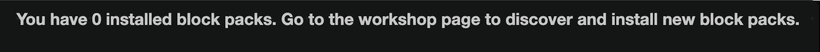
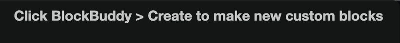

# Workshop and BlockBuddy

The last two categories in the toolbox are not fixed. What is in them depends on what you have installed and what you have generated.

## Workshop

The Workshop category holds the **block packs** you have installed. A block pack is a set of blocks somebody built and shared, so you can use their work without rebuilding it.

Until you install one, the category shows a note telling you where to go.

To install a pack:

1. Open **Workshop** in the DisFuse dashboard.
2. Browse the listing, or open **Your Library** to see what you already have.
3. Open a pack and install it.
4. Reopen your project. The pack's blocks appear under Workshop, in their own subcategory.

Packs are versioned. When the author releases an update, you choose whether to move to it, so a change on their side cannot break your bot without warning.

See [Workshop](../Features/workshop.md) for how to browse, install and build packs.

## BlockBuddy

BlockBuddy generates blocks from a description. Tell it what you want in plain words and it builds an arrangement of blocks for you, which then appears in this category ready to drag onto the canvas.

It is a starting point rather than a finished feature. Read what it produced, adjust the values, and connect it to the rest of your bot yourself.

## Building your own pack

If you find yourself rebuilding the same thing in every project, turn it into a pack:

1. Go to **Workshop** and click **Create**.
2. Give the pack a name, a color and a description.
3. Define your blocks in the Workshop editor: their text, their inputs, and the code they generate.
4. Publish a version.

Keep it private for your own use, or make it public so other people can install it.

See [Workshop](../Features/workshop.md) for the full walkthrough.
