# Bot Control

Control is a Discord client that acts **as your bot**. You open it on the DisFuse website and you see the servers your bot is in, the channels it can read, and the people in them. Anything you do there, your bot does.

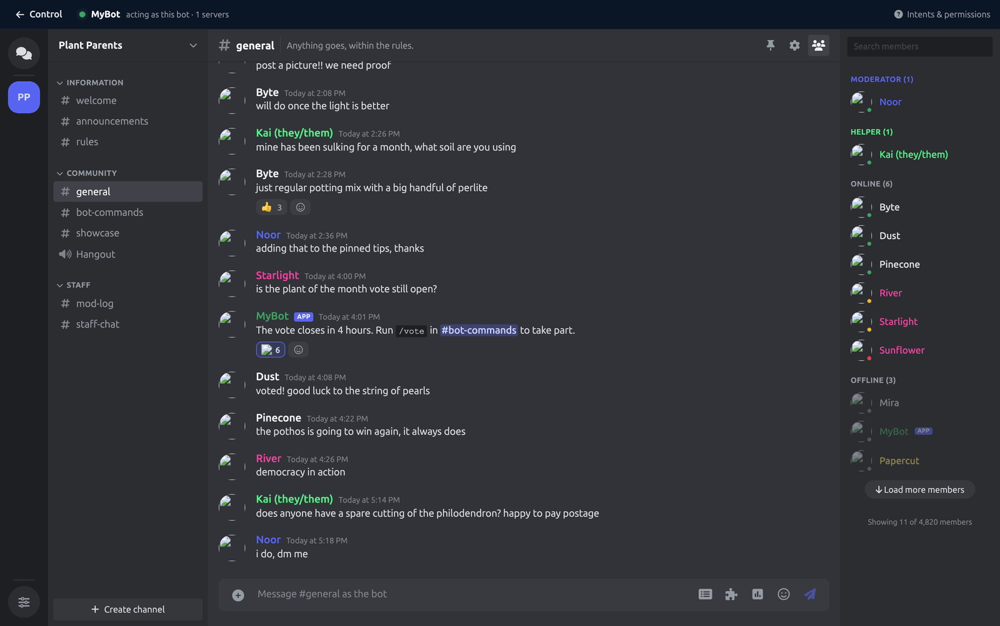

:::info
Control is free for every bot, and only the bot's owner can use it. Collaborators cannot, even on a project they can edit.
:::

## What it is for

- **Talking as your bot** without writing a command for it. Announcements, replies, corrections.
- **Moderating** without leaving DisFuse: kick, ban, timeout, delete, manage roles.
- **Seeing what your bot sees.** If a command is not working in a server, Control shows you exactly which channels and permissions your bot actually has there.
- **Sending rich messages by hand:** embeds, buttons, menus and polls, built in a form rather than in blocks.

## Opening it

Go to **Control** in the dashboard. Every bot you own is listed, with whether it is ready.

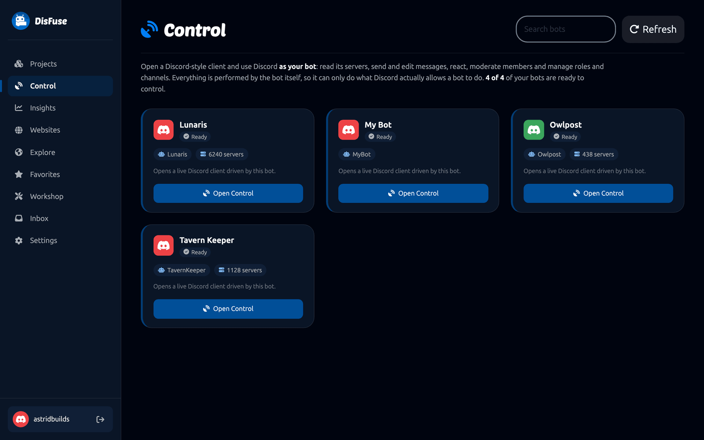

Click **Open Control** on one. DisFuse connects that bot to Discord for you, which takes a few seconds the first time.

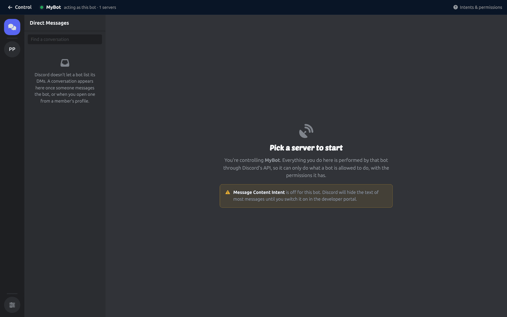

The bar at the top always tells you which bot you are acting as, and **Intents and permissions** on the right warns you about anything Discord is not letting the bot do.

## Finding your way around

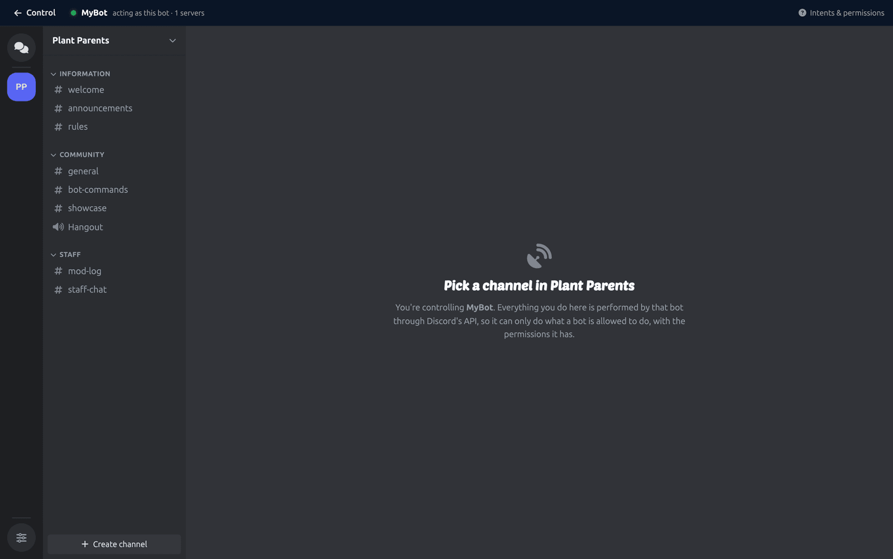

The layout is Discord's, because that is what everybody already knows.

- **The rail** on the far left lists every server your bot is in, plus direct messages.
- **The channel list** shows the channels your bot can see in the selected server, in their categories.
- **The message view** in the middle shows history, and the box at the bottom sends as the bot.
- **The member list** on the right shows who is in the server, grouped by role.

Channels your bot cannot see do not appear at all, which is itself useful information.

## Sending messages

Type in the box at the bottom and press Enter. The message is sent by your bot, in that channel.

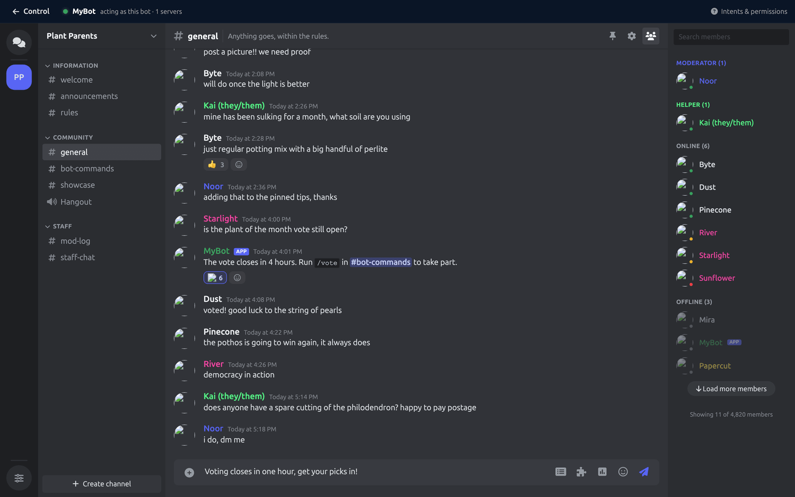

The icons beside the box open the richer options.

### Embeds

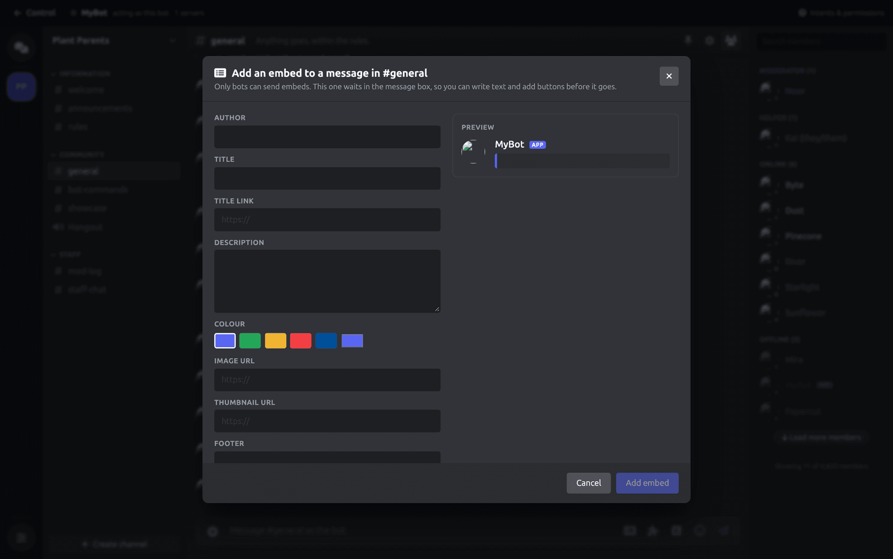

Fill in the author, title, description, color, images and footer, with a live preview beside it. The embed waits in the message box, so you can add text and buttons before sending.

### Buttons and menus

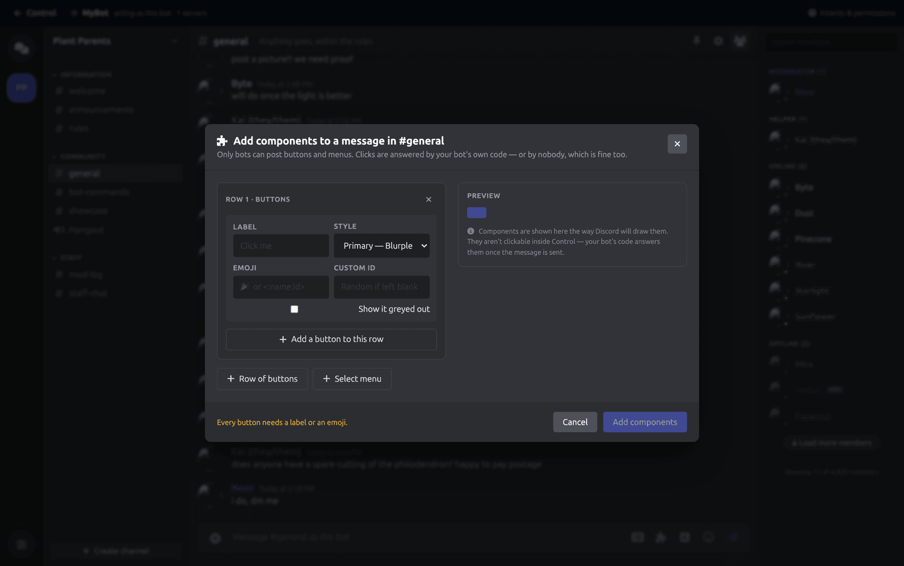

Build rows of buttons and select menus. Give each one a label, a style and a custom ID.

The components are not clickable inside Control. They are answered by your bot's own [button](../Blocks/Components/buttons.md) and [menu](../Blocks/Components/select-menus.md) blocks once the message is out, or by nobody at all, which is fine for a link button.

### Polls

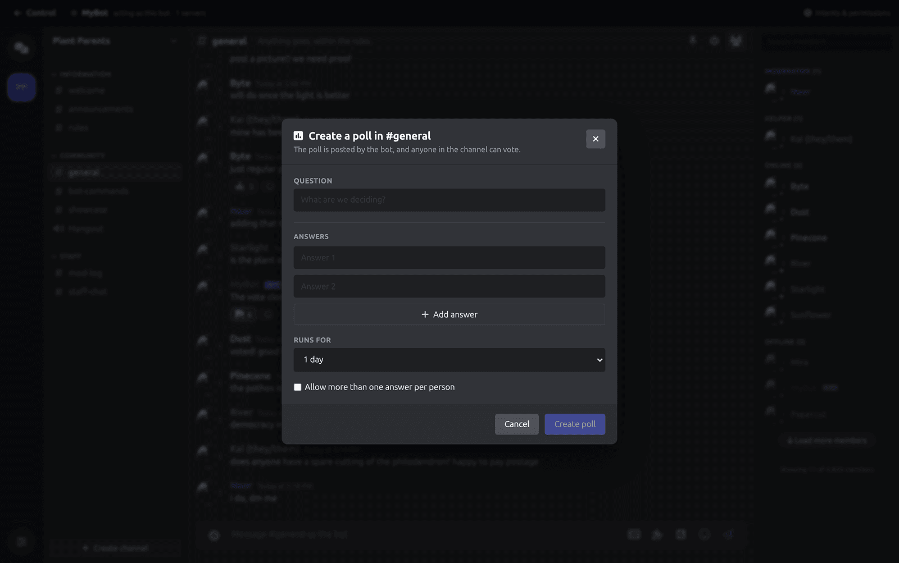

Create a Discord poll with a question, up to ten choices, and a duration. It is posted by your bot, and anyone in the channel can vote.

### Attachments

Attach up to 10 files per message, within Discord's size limits.

## Acting on a message

Hover a message for the actions your bot is allowed to take: reply, edit (its own messages only), delete, pin, react, and start a thread.

The pin icon at the top of the channel shows what is already pinned.

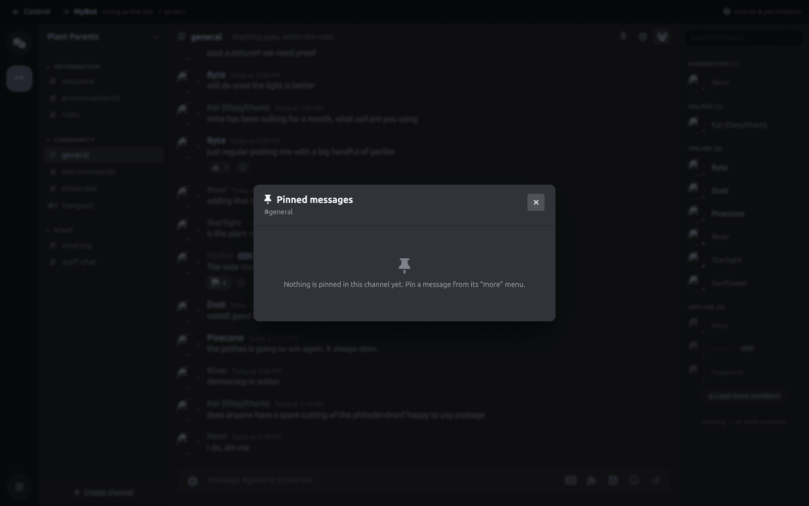

## Acting on a member

Click somebody in the member list to open their profile.

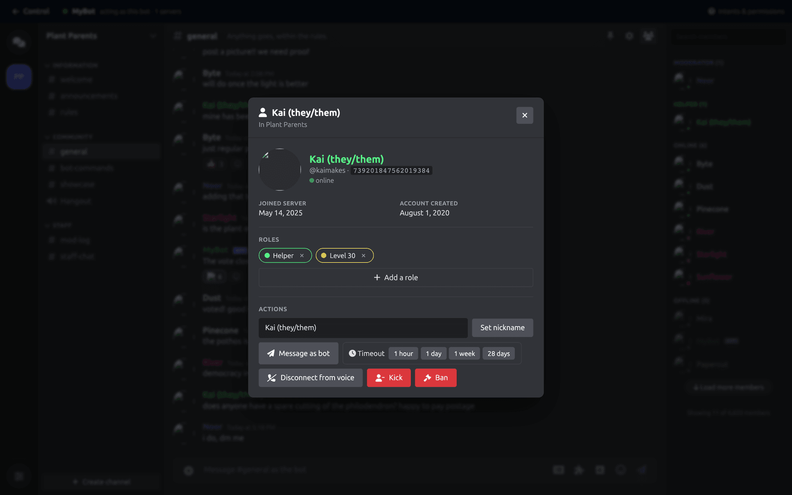

From there you can add and remove roles, set a nickname, time them out for a preset length, disconnect them from voice, kick them, ban them, or open a direct message.

Everything is done through Discord, so the same limits apply: your bot cannot moderate somebody whose highest role is above its own, and every action is written into the server's audit log as your bot.

## Server settings

Click the server name for a panel covering the whole server.

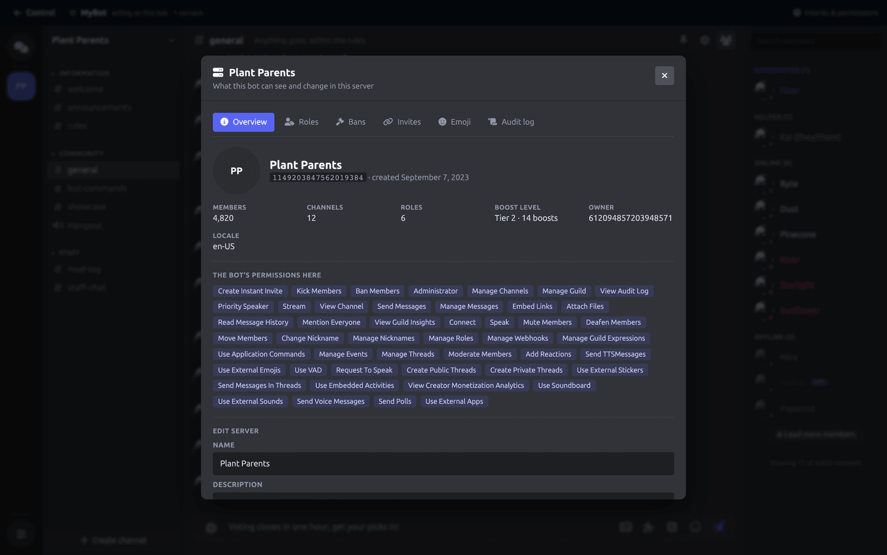

| Tab | What it shows |
| --- | --- |
| **Overview** | Members, channels, roles, boost level, owner, and every permission your bot has here. |
| **Roles** | The role list, with what each one can do. |
| **Bans** | Who is banned, and why. |
| **Invites** | Active invites, their creators and their uses. |
| **Emoji** | The server's custom emojis. |
| **Audit log** | Recent moderation actions. |

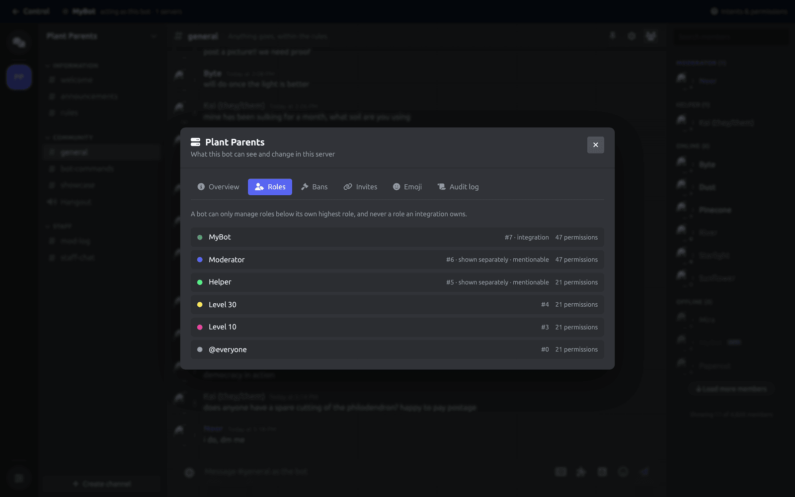

The Roles tab is worth a look when a role action is refused: it shows where your bot's own role sits, and a bot can only manage roles below it.

The permission list on the Overview tab is the quickest way to answer "why is my bot not doing X in this server".

## What Control cannot do

Control is your bot, so it is bound by exactly what a bot is allowed to do:

- It cannot read channels the bot has no access to.
- It cannot edit anyone else's messages.
- It cannot see the text of most messages unless the **Message Content Intent** is on. Control tells you when it is off.
- It cannot act above the bot's own role in the hierarchy.
- It cannot list the bot's direct message conversations. Discord does not offer that. A DM appears once somebody messages the bot, or when you open one from a member's profile.

## Limits

- Up to 4 Control sessions open at once per DisFuse account.
- 40 actions per 10 seconds per session, so a burst of clicks is fine and a script is not.
- Attachments follow Discord's own limits.

## Safety

Control is genuinely your bot. A message you send is indistinguishable from one your code sent, and a ban you issue is a real ban.

- Every moderation action is attributed to your bot in the audit log, with a reason.
- Only the owner can open Control. That is checked on DisFuse's servers, not just hidden in the interface.
- If your subscription lapses mid-session, the session ends rather than continuing.
