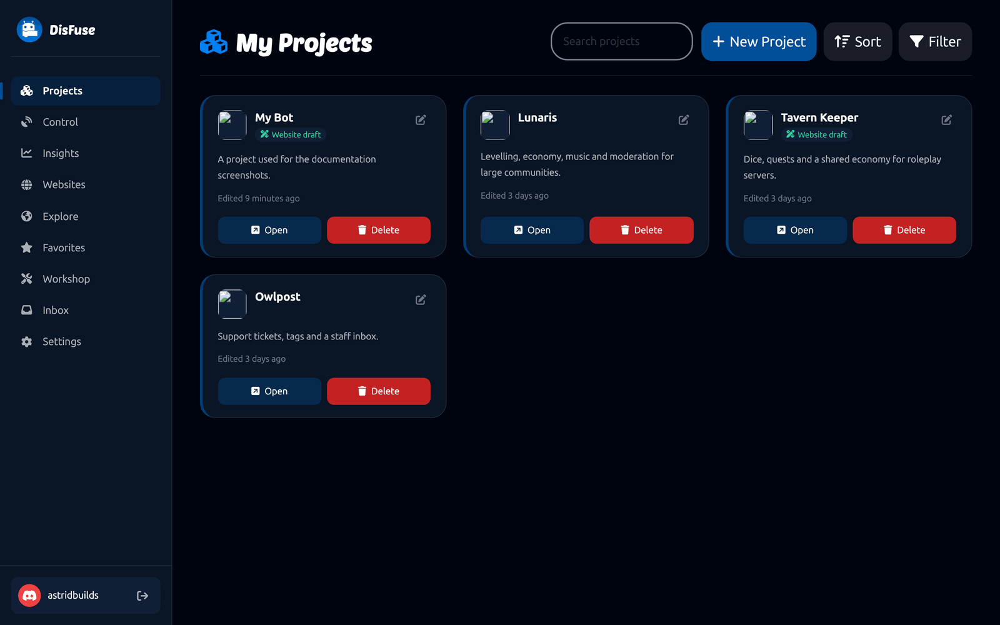
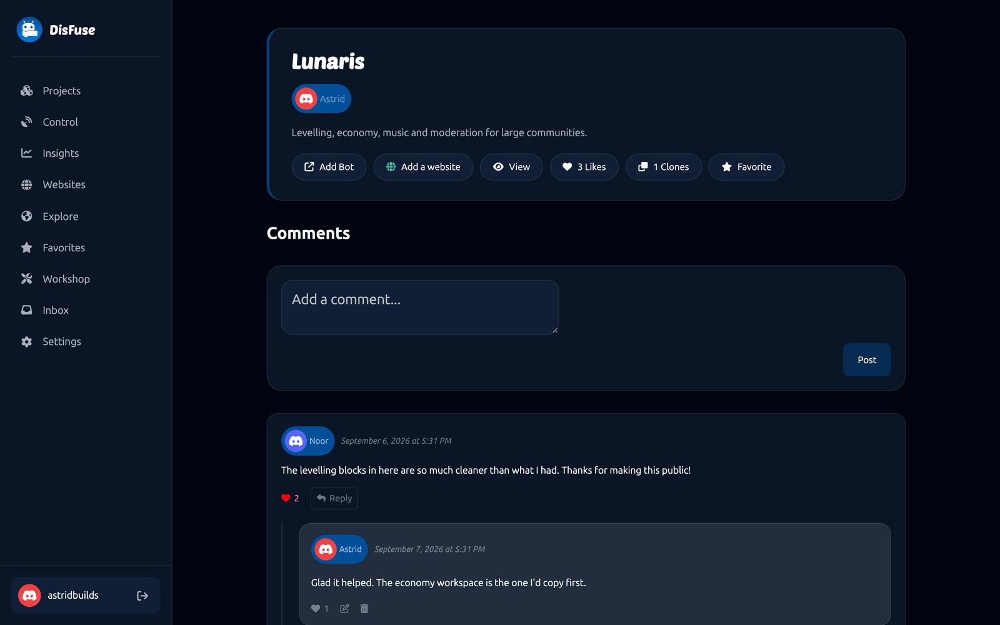
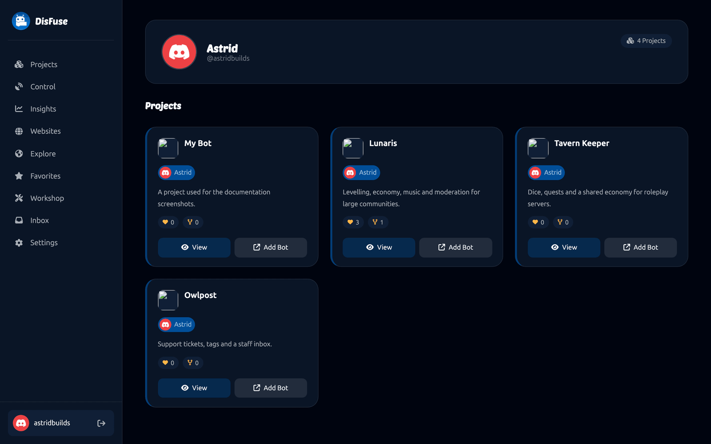

# The Dashboard

The dashboard is everything on the DisFuse website outside the block editor. This page is a map of it.

## The sidebar

| Item | What it is |
| --- | --- |
| **Projects** | Your bots, and the projects you have been invited to. |
| **Control** | Act as any bot you own. [Premium](premium.md). See [Bot Control](control.md). |
| **Insights** | What your bots are doing. [Premium](premium.md). See [Insights](insights.md). |
| **Websites** | Build and publish a site for a bot. [Premium](premium.md). See [Websites](websites.md). |
| **Explore** | Public projects and bots made by other people. See [Explore](explore.md). |
| **Favorites** | Projects you saved. |
| **Workshop** | Block packs to install, and your own to build. See [Workshop](workshop.md). |
| **Inbox** | Notifications. See [Inbox](inbox.md). |
| **Settings** | Editor preferences, notifications and your subscription. See [Settings](settings.md). |

Your name and avatar are at the bottom, with the log out button.

## Projects

Every project you own, and every project somebody has invited you to.

Each card shows the bot's avatar, the project name, the description and when it was last edited. Projects with a [website](websites.md) are marked.

| Button | What it does |
| --- | --- |
| **Open** | Opens the block editor. |
| **Delete** | Deletes the project permanently. |
| The pencil | Opens [project settings](../Guide/project-settings.md). |

**New Project** creates one. See [Creating a project](../Guide/creating-a-project.md).

**Search**, **Sort** and **Filter** at the top help once you have more than a handful.

## Project pages

Clicking a project's name opens its page, which is what other people see if the project is public.

It shows the description, the bot, and the counts of likes, clones and favorites, with the comment thread underneath.

From here you can:

- **Open** the editor, if you have access
- **Add Bot**, if the bot is public
- **Website**, if it has a published one
- **Like**, **Favorite** and **Clone**
- **Edit**, if it is yours

## Cloning

Cloning copies somebody's public project into your own account, blocks and all. It is a good way to learn: take something that works, open it, and change it.

Cloning never copies [secrets](../Guide/secrets.md) or the bot token. A clone is yours to point at your own bot.

## Your profile

Your username at the bottom of the sidebar opens your profile page, which lists your public projects and your published block packs. Other people's profiles show the same, and you reach them by clicking their name anywhere on the site.

## Getting help

Every page has the same [Discord server](https://dsc.gg/disfuse) behind it. If something in the dashboard is not behaving, ask in the support channel.
