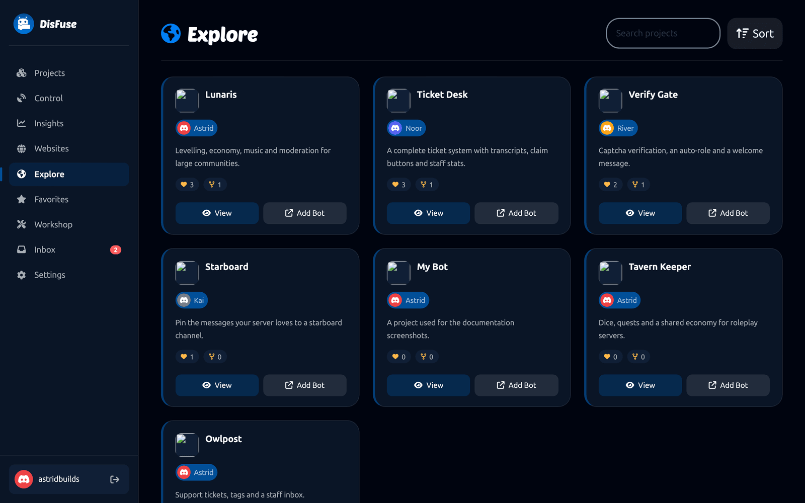
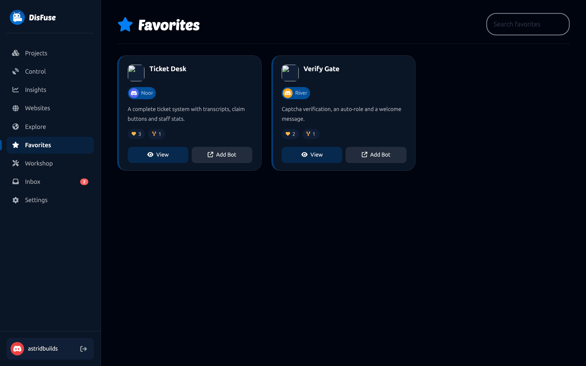
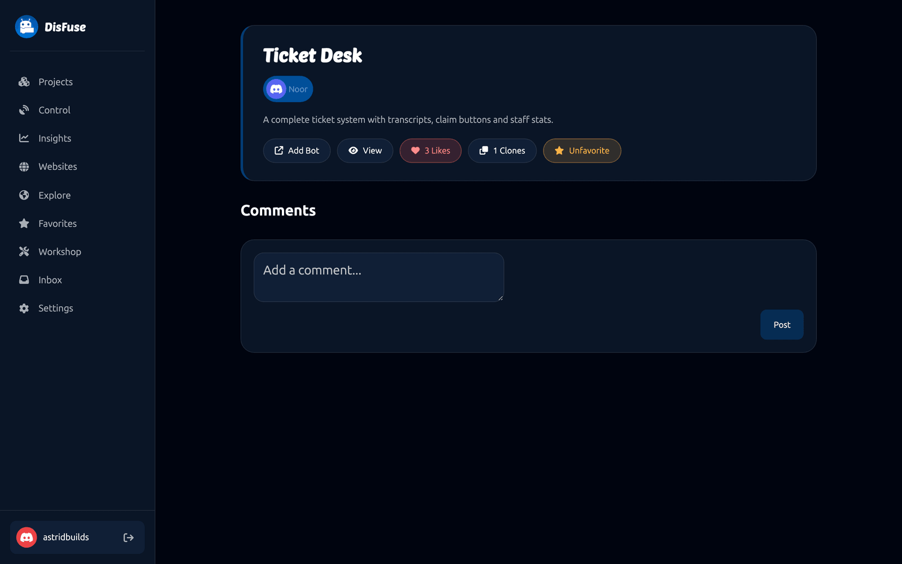

# Explore and Community

DisFuse is not only a bot builder. Public projects can be read, liked, commented on and copied, which makes the Explore page the fastest way to learn how other people build things.

## Explore

**Explore** lists every public project on DisFuse. Each card shows the bot, the owner, the description, and how many likes and clones it has.

- **View** opens the project's page.
- **Add Bot** invites that bot to a server, when its owner has made the bot public.

Use **Search** to find projects by name, and **Sort** to order by newest, most liked or most cloned.

## What "public" means

A project owner chooses two things separately in [project settings](../Guide/project-settings.md):

- **Project visibility** decides whether anyone can read the blocks.
- **Bot visibility** decides whether anyone can add the bot to their server.

Secrets and bot tokens are never public, whatever those are set to.

## Likes, favorites and clones

| Action | What it does |
| --- | --- |
| **Like** | A public thumbs up. The count is on the project card. |
| **Favorite** | Saves it to your **Favorites** page. Private to you. |
| **Clone** | Copies the whole project into your account. |

Cloning is the interesting one. You get every block, in your own project, to open and change. [Secrets](../Guide/secrets.md) are never copied, so a clone needs its own bot token before it will run.

Owners are notified when somebody likes or clones their project.

## Comments

Every public project has a comment thread on its page. Ask how something works, report a problem, or say what you built with it. Comments can be replied to and liked.

The project owner is notified in their [inbox](inbox.md) when somebody comments.

## Profiles

Clicking a username opens that person's profile: their public projects and the block packs they have published in the [Workshop](workshop.md).

## Publishing your own work

Making a project public is one dropdown in [project settings](../Guide/project-settings.md). Before you do:

1. **Check your secrets.** Anything sensitive typed directly into a block is about to be visible. Move it to a [secret](../Guide/secrets.md) first.
2. **Write a description.** It is the only thing most people read before deciding whether to look.
3. **Tidy up.** Delete the half-finished blocks, name the [workspaces](../Guide/workspaces.md), and add [comments](../Blocks/comments.md) where the logic is not obvious.

## Rules

Public projects and comments are covered by DisFuse's [Terms of Service](https://disfuse.xyz/tos). Projects that break them can be suspended, which freezes the project: the owner can still see it and delete it, but nobody can edit it.

If you find something that should not be on the site, report it in the [DisFuse Discord server](https://dsc.gg/disfuse).
