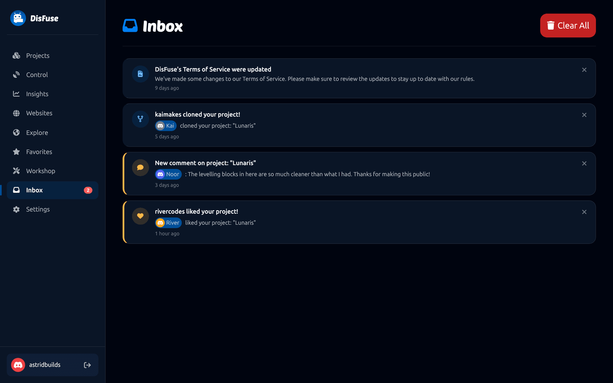

# Inbox

The inbox is where DisFuse tells you about things that happened while you were away.

## What arrives

| Notification | When |
| --- | --- |
| **Somebody liked your project** | A public project of yours got a like. |
| **New comment on your project** | Somebody commented on one of your projects. |
| **Somebody replied to your comment** | A reply to a comment you left. |
| **Somebody cloned your project** | Your project was copied into somebody's account. |
| **Project invite** | You were added as a [collaborator](../Guide/collaboration.md). |
| **Terms of Service updated** | DisFuse's terms changed. |

## Reading it

Unread items are highlighted, and the sidebar shows a count next to **Inbox**. Opening the page marks everything read.

Click an item to go where it happened: the project page for a like, the comment itself for a comment or reply, the editor for a project invite.

The X on an item removes that one. **Clear All** empties the inbox, with a confirmation first.

## Discord DMs

DisFuse can also send you a direct message on Discord for each of these. Choose which in **Settings > Notifications**.

Each notification type can be set to inbox and DM, inbox only, or off.

:::info
If your Discord DMs are closed to members of the DisFuse server, DisFuse cannot message you and only the inbox is used. Nothing is lost either way.
:::

## Nothing arrives?

If your inbox is empty and you expected something:

- Likes and comments only happen on **public** projects. A private project cannot receive either.
- Check the notification type is not switched off in Settings.
- Your own actions never notify you. Liking your own project does nothing.
