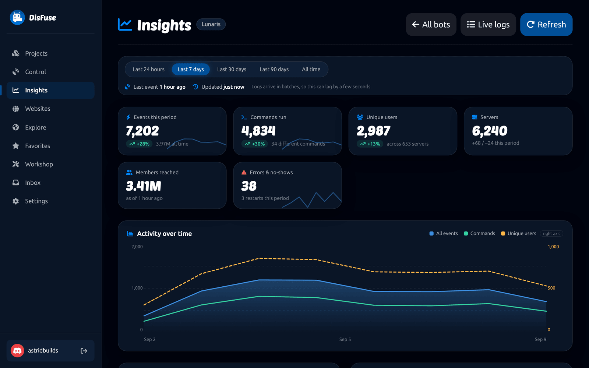
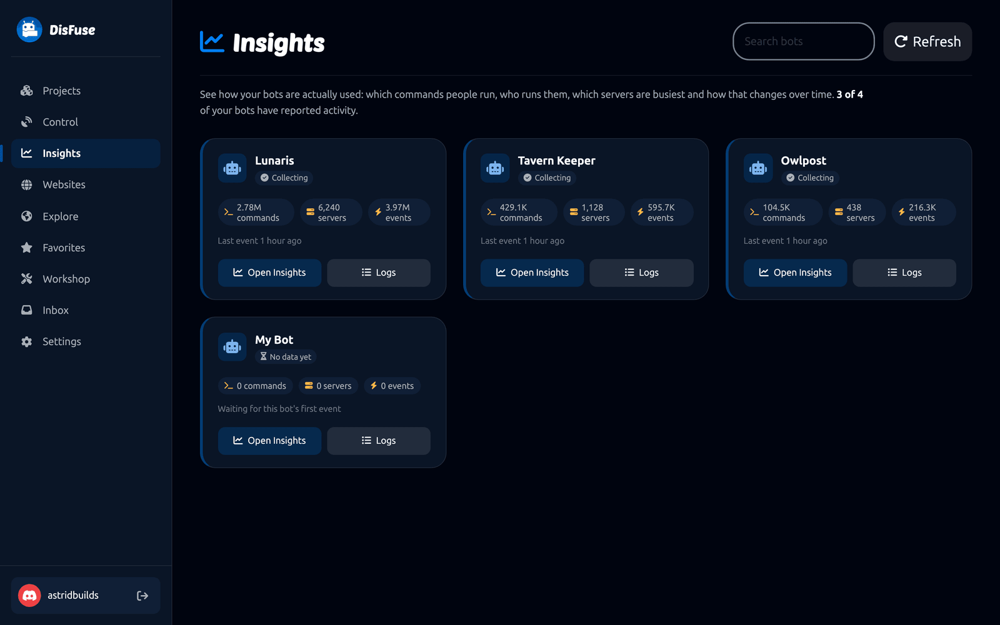
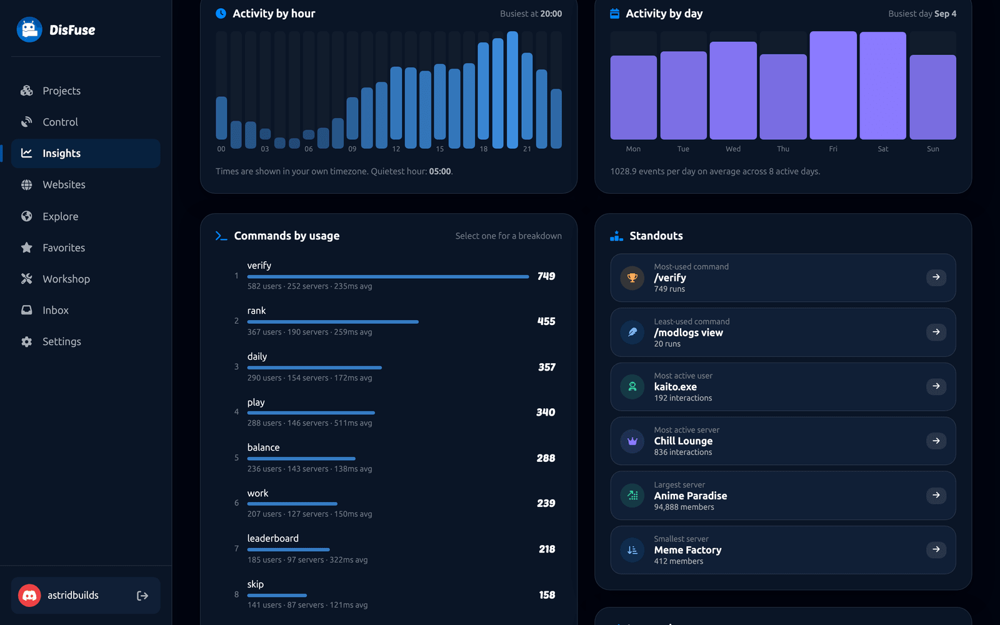
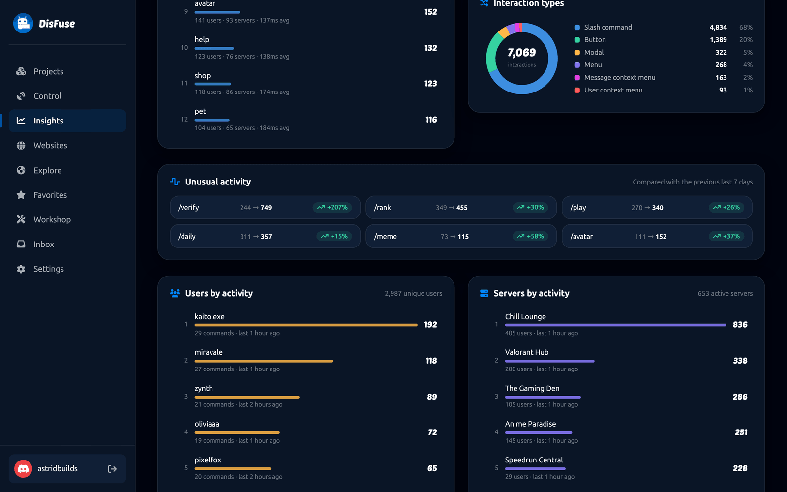
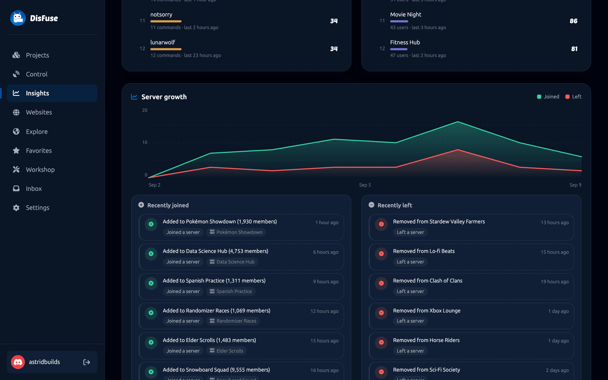
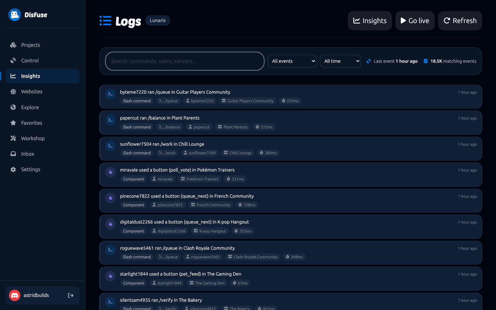

# Insights

Insights shows you what your bot is actually doing: which commands people run, who runs them, in which servers, and how that changes over time.

:::info
Insights is free for every bot, and only the bot's owner can see it. Free accounts keep 7 days of history; [DisFuse Premium](premium.md) keeps up to 90.
:::

## How it works

Every project DisFuse exports includes a small piece of reporting code. When your bot handles a command, a button, a menu, a modal or a context menu, it notes what happened and sends a batch to DisFuse every ten seconds.

It reports the command name, who ran it, which server and channel, how long it took, and whether it succeeded. It never reads or sends message content.

The reporting code identifies itself with your bot's own token, which DisFuse checks against the project, so nobody else can write into your Insights.

:::tip
Set `DISFUSE_INSIGHTS=off` in your host's environment variables to switch reporting off entirely.
:::

## Choosing a bot

Open **Insights** in the dashboard to see every bot you own that is reporting.

Each card shows how recently that bot was heard from, so you can tell at a glance whether one has stopped.

## The dashboard

### Time range

The row of buttons at the top picks the period: last 24 hours, 7 days, 30 days, 90 days, or all time. Everything below it changes to match.

The line under it tells you when the last event arrived and when the page last updated. Events arrive in batches, so a lag of a few seconds is normal.

### The numbers

| Card | What it counts |
| --- | --- |
| **Events this period** | Everything: commands, buttons, menus, modals and errors. |
| **Commands run** | Slash commands only, plus how many distinct ones were used. |
| **Unique users** | Individual people, across all servers. |
| **Servers** | How many servers your bot is in, and how that changed this period. |
| **Members reached** | The total membership of every server it is in. |
| **Errors and no-shows** | Failures, and restarts. |

Each card shows the change against the previous period of the same length, so a "+28%" means this week against last week.

### Activity over time

The main chart plots all events, commands and unique users together. Below it, **Activity by hour** and **Activity by day** show when your bot is busiest, in your own time zone.

That is more useful than it sounds: it tells you when to schedule an update so the fewest people notice.

### Commands by usage

Every command, ranked, with how many people used it, how many servers it ran in, and its average response time.

Two things to look for: a command nobody uses, and a command whose average time is far higher than the rest. The first is a candidate for removal, the second for a `defer reply`.

Click a command for a breakdown of just that command.

### Standouts

A short list of the extremes: most and least used command, most active user, most active server, largest and smallest server. Each one links through to a focused view.

### Interaction types

The split between slash commands, buttons, menus, modals and context menus. A bot that is almost all buttons is a very different thing from one that is almost all commands.

### Unusual activity

Commands whose usage moved sharply against the previous period. A sudden jump can be a feature catching on, or somebody hammering a command that needs a [cooldown](../Blocks/cooldowns.md).

### Users and servers by activity

Who uses your bot most, and where. Useful for spotting a single server that accounts for most of your traffic, and for noticing a user whose activity does not look human.

### Server growth

Joins and leaves over time, with a list of the servers your bot was recently added to and removed from.

A steady leave rate right after joins usually means something goes wrong during setup.

## Live logs

Click **Live logs** for the raw event stream.

Every event, newest first, with the command name, the user, the server, the channel and how long it took.

- **Search** by command, user or server.
- **Filter** by event type and by time.
- **Go live** streams new events as they arrive.

This is where you go when a specific person says a specific command failed.

## Retention and clearing

At the bottom of the dashboard are the data settings.

**Retention** is how long DisFuse keeps individual log rows: 7, 14, 30, 60 or 90 days. Free accounts can keep up to 7 days, and [DisFuse Premium](premium.md) unlocks up to 90. Lifetime totals are always kept, whatever you choose.

**Clear insight data** deletes the stored logs for that bot. You are asked to confirm first, and it cannot be undone.

## If nothing appears

| Symptom | Cause |
| --- | --- |
| No bots listed | None of your bots have reported yet. Export and run one. |
| A bot listed but no events | It has not handled an interaction since it started. |
| Events stopped | The bot is offline, or it was re-exported with `DISFUSE_INSIGHTS=off`. |
| An old export reports nothing | Re-export. Reporting is written in at export time. |

## Privacy

Insights records what people do with your bot, not what they say. Message content is never collected. If your bot is in servers you do not own, tell people what your bot records; a line in your bot's `/help` or on its [website](websites.md) is enough.
