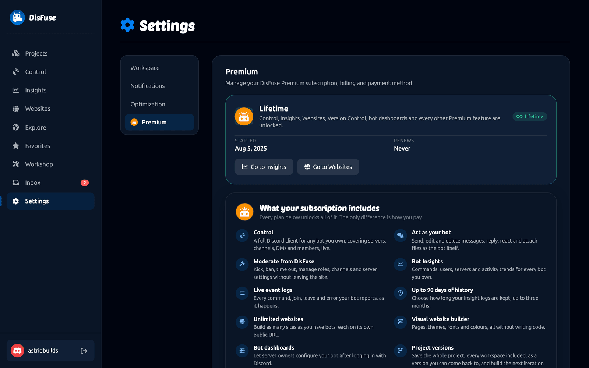

# DisFuse Premium

Everything in DisFuse's block editor is free. Premium adds the features that sit around it: seeing what your bot does, controlling it from the website, giving it a real web dashboard, and keeping versions of your project.

## What is included

| Feature                                             | What it does                                                                                        |
| --------------------------------------------------- | --------------------------------------------------------------------------------------------------- |
| **[Bot Control](control.md)**                       | A full Discord client for any bot you own, covering servers, channels, DMs and members, live.       |
| **Act as your bot**                                 | Send, edit and delete messages, reply, react and attach files as the bot itself.                    |
| **Moderate from DisFuse**                           | Kick, ban, time out, manage roles, and change channel and server settings without leaving the site. |
| **[Bot Insights](insights.md)**                     | Commands, users, servers and activity trends for every bot you own.                                 |
| **Live event logs**                                 | Every command, button, join, leave and error your bot reports, as it happens.                       |
| **Up to 90 days of history**                        | Choose how long Insight logs are kept, up to three months.                                          |
| **Unlimited [websites](websites.md)**               | One site per bot, each on its own public URL.                                                       |
| **Visual website builder**                          | Pages, themes, fonts and colors, without writing code.                                              |
| **Bot dashboards**                                  | Let server owners configure your bot by logging in with Discord.                                    |
| **[Project versions](../Guide/version-control.md)** | Snapshot the whole project, come back to any of them, and build the next iteration safely.          |

Every plan unlocks all of it. The only difference is how you pay.

## Plans

| Plan               | Price           |
| ------------------ | --------------- |
| **Premium**        | $4.99 per month |
| **Premium Yearly** | $44.99 per year |
| **Lifetime**       | $99, paid once  |

## Subscribing

Go to **Settings > Premium** in the dashboard and pick a plan. Payment is handled by Stripe; DisFuse never sees your card details.

Premium applies to your **account**, not to one bot. Every project you own gets it.

## Managing your subscription

The same page shows what you are on, when it started, and when it renews. From there you can update your payment method, change plan, or cancel.

Canceling leaves your subscription running until the end of the period you have paid for. Nothing stops early.

## The Discord role

Subscribers get a Premium role in the [DisFuse Discord server](https://dsc.gg/disfuse). It is applied and removed automatically to match your real access, so there is nothing to claim.

## If your subscription ends

| Feature             | What happens                                                                                    |
| ------------------- | ----------------------------------------------------------------------------------------------- |
| **Version Control** | Your versions stay. You can read, switch to and export any of them. You cannot create new ones. |
| **Websites**        | Published sites can no longer be accessed by bot users, and you cannot edit or publish them.    |
| **Insights**        | Your bot keeps reporting. The dashboard is locked until you resubscribe.                        |
| **Control**         | Sessions end and cannot be reopened.                                                            |
| **Your blocks**     | Untouched. The editor is free and always will be.                                               |

## What stays free

Everything that makes a bot:

- Every block in the toolbox
- Unlimited projects and workspaces
- Real-time collaboration
- Secrets
- The Workshop, both installing and publishing packs
- Explore, favorites, likes, comments and cloning
- Exporting your bot, as often as you like

Premium is about what you do with a bot once it exists, not whether you can build one.
