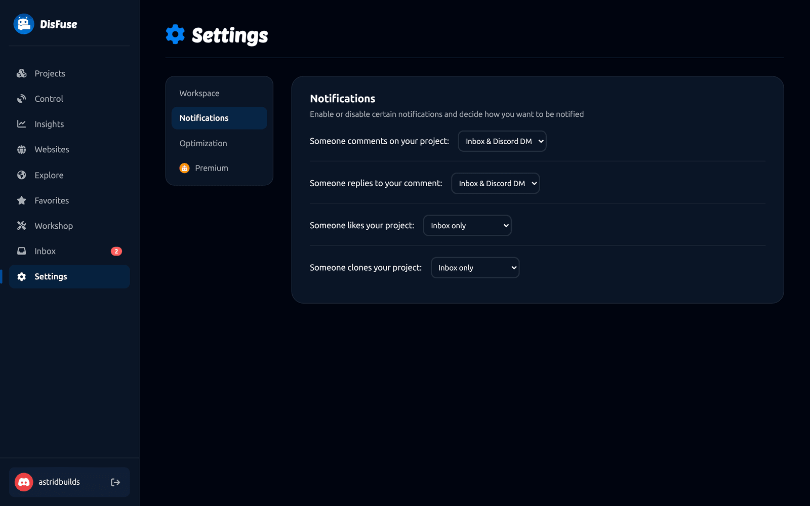
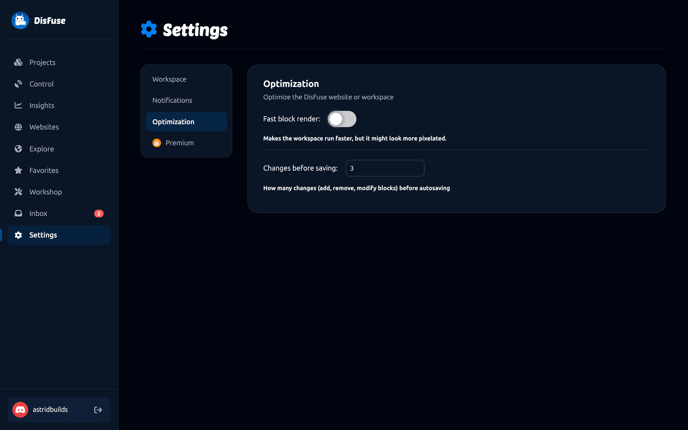

# Settings

Four pages, reached from **Settings** in the dashboard sidebar.

## Workspace

How the block editor looks and behaves.

| Setting | What it does |
| --- | --- |
| **Workspace theme** | The editor's color scheme. Dark, Darker, Light, Blue and Black, or Candy. Block colors stay the same in every theme, so a Text block is always the same green. |
| **Workspace renderer** | The shape of the blocks. Zelos is the rounded scratch-like default; Geras and Thrasos are Blockly's more angular shapes. |
| **Workspace sounds** | The click when blocks connect and the sound when one is deleted. |
| **Show grid** | The dotted grid on the canvas. |
| **Snap to grid** | Blocks line up to the grid when dropped. Makes a busy canvas much tidier. |
| **Grid spacing** | How far apart the dots are. |
| **Icons on toolbar** | The icons next to the toolbar buttons. Turn them off for a plainer bar. |
| **Show Autosave on toolbar** | The saving indicator. |

Changes apply the next time you open a project.

## Notifications

What you are told about, and where.

| Event | |
| --- | --- |
| Somebody comments on your project | |
| Somebody replies to your comment | |
| Somebody likes your project | |
| Somebody clones your project | |

Each one can be set to:

- **Inbox and Discord DM**, which sends a direct message as well as an inbox item
- **Inbox only**
- **Off**

:::info
Discord DMs need your DMs open to members of the DisFuse server. If you have those closed, DisFuse cannot reach you and only the inbox is used.
:::

## Optimization

For big projects and slower computers.

**Fast block render** makes the editor faster by rendering blocks more crudely. Text and edges look rougher. Worth turning on if a large workspace feels sluggish.

**Changes before saving** is how many block changes happen before DisFuse saves. The default is 3.

- A **lower** number saves more often, which is safer and slightly busier.
- A **higher** number saves less often, which is lighter on a slow connection but risks losing more if the tab closes.

Saving always happens on a timer as well, so nothing is ever left unsaved for long.

## Premium

Your subscription: what plan you are on, when it renews, and how to change or cancel it.

See [DisFuse Premium](premium.md).

## Where other settings live

| Setting | Where |
| --- | --- |
| Project description, visibility, permissions, bot token | [Project settings](../Guide/project-settings.md) |
| Secrets | `Utilities > Secrets` in the editor. See [Secrets](../Guide/secrets.md) |
| Collaborators | **Invite** in the editor. See [Collaboration](../Guide/collaboration.md) |
| Insights retention | The bottom of the [Insights](insights.md) dashboard |
| Website theme and dashboard access | The Site tab of the [website builder](websites.md) |
