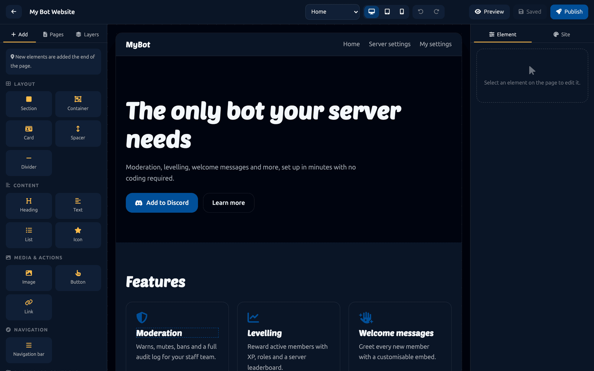
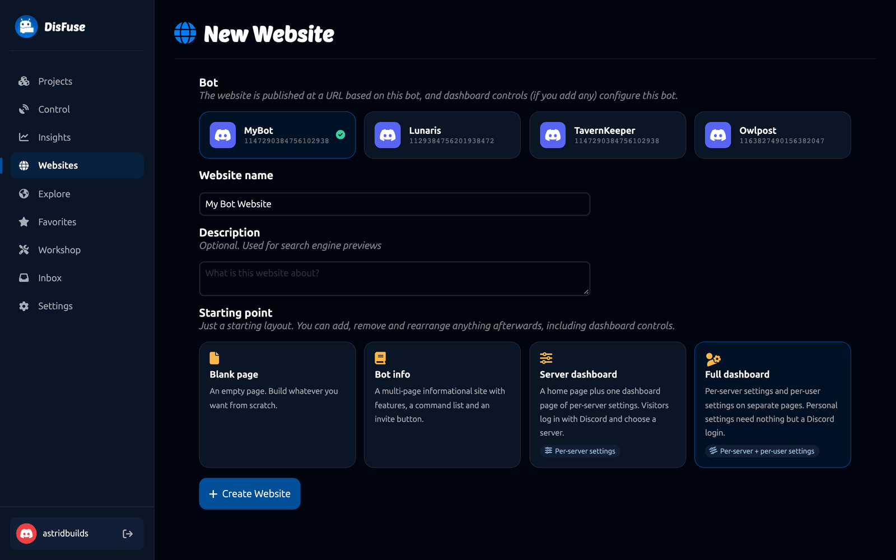
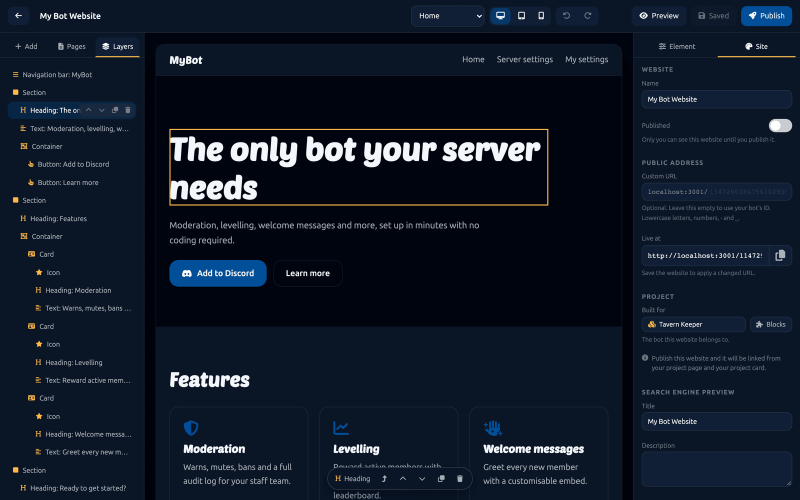
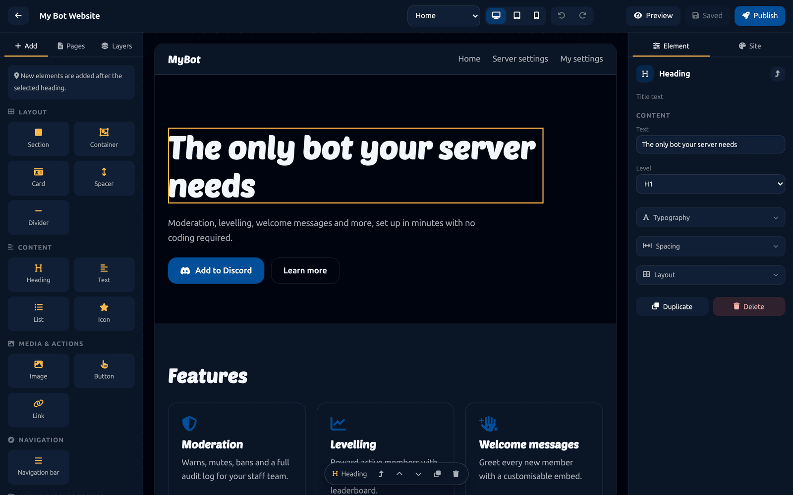
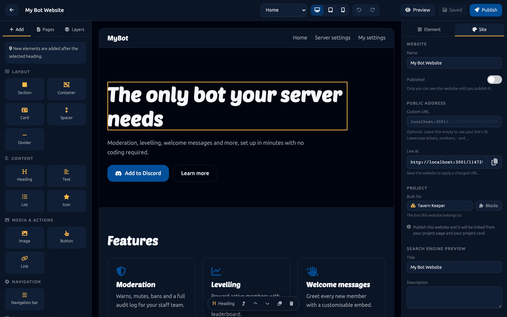
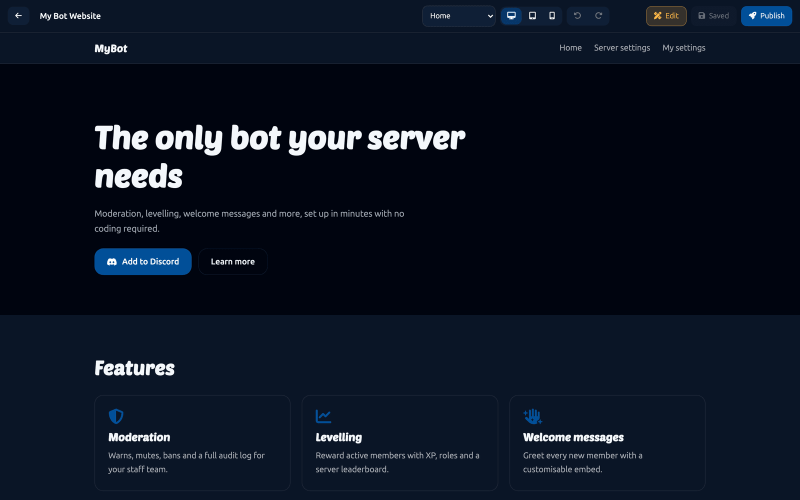
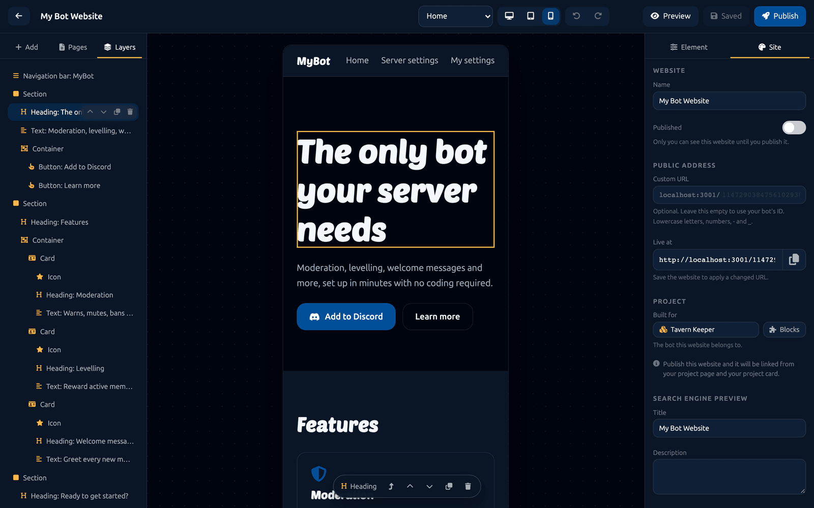
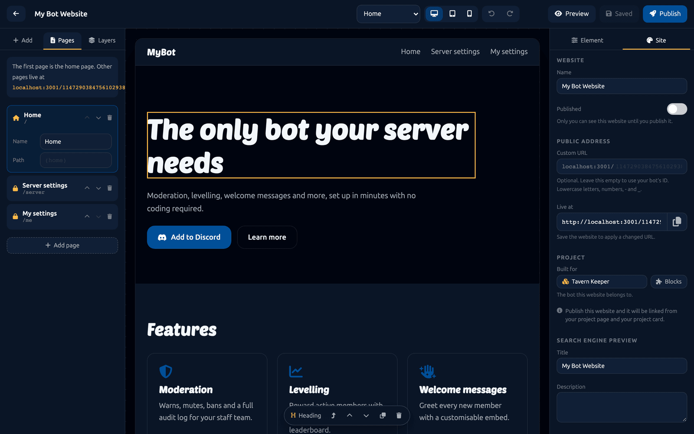
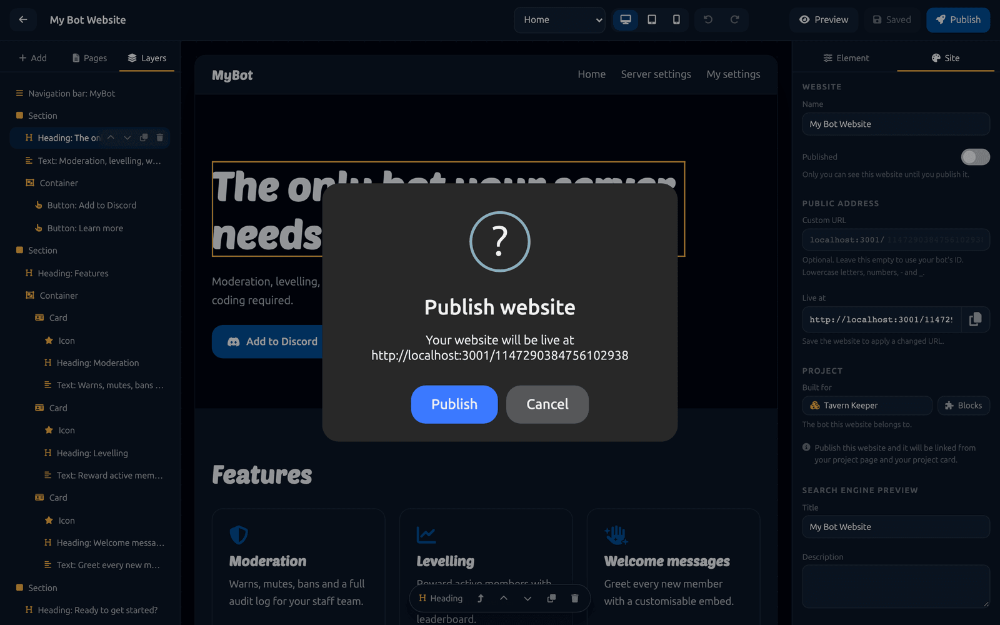
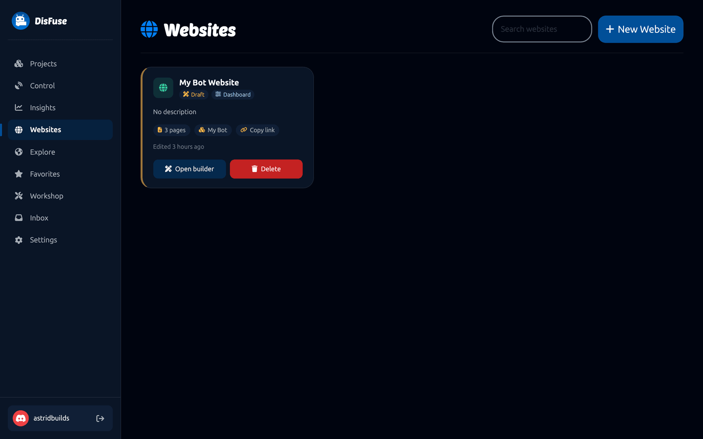

# DisFuse Websites

A DisFuse Website is a real web page for your bot, built with a drag-and-drop editor and published on a public URL. It can be a landing page, a command list, an invite page, or a full dashboard where server owners configure your bot.

:::info
Websites are free. Every bot you own can have one, up to 5 websites on a free account or 30 with [DisFuse Premium](premium.md).
:::

## Creating one

Go to **Websites** in the dashboard and click **New Website**.

| Step | What you choose |
| --- | --- |
| **Bot** | Which of your bots the site belongs to. One website per bot. |
| **Website name** | The name shown in the dashboard and used as the default page title. |
| **Description** | Used for search engine previews. Optional. |
| **Starting point** | A template to begin from. |

The templates are:

| Template | What you get |
| --- | --- |
| **Blank page** | Nothing. Build it yourself. |
| **Bot info** | A multi-page information site with features, a command list and an invite button. |
| **Server dashboard** | A home page plus one dashboard page of per-server settings. |
| **Full dashboard** | Per-server and per-user settings on separate pages. |

The template only decides what is on the page to start with. You can add, remove and rearrange anything afterwards.

## The builder

Three areas.

**Left panel.** Three tabs.

- **Add** lists every element you can drop onto the page.
- **Pages** manages the pages of your site.
- **Layers** shows the page as a tree, which is the easiest way to select something buried inside a container.

**Canvas.** The page itself. Click anything to select it. Double-click text to edit it in place.

**Right panel.** Two tabs.

- **Element** is the settings for whatever is selected.
- **Site** is the settings for the whole site.

Along the top: the page picker, the desktop, tablet and mobile buttons, undo and redo, a preview toggle, the save state, and **Publish**.

## Elements

| Group | Elements |
| --- | --- |
| **Layout** | Section, Container, Card, Spacer, Divider |
| **Content** | Heading, Text, List, Icon |
| **Media and actions** | Image, Button, Link |
| **Navigation** | Navigation bar |
| **Dashboard** | Toggle, text, number and dropdown settings, channel and role pickers, a save button, and a server info panel |

Elements nest. Put a Container inside a Section, Cards inside the Container, and Headings and Text inside each Card.

## Styling

With something selected, the Element tab gives you:

- **Layout**: direction, alignment, wrapping, gap, width and height
- **Spacing**: padding and margin
- **Typography**: font, size, weight, letter spacing, color and alignment
- **Background**: color or image
- **Border and corners**: style, width, color, radius and shadow

The Site tab sets the theme for everything at once: the color palette, the fonts, the favicon and the search engine preview.

## Responsive design

Use the desktop, tablet and mobile buttons at the top to check each width, and **Preview** to see the page without the editing handles.

Most layouts need one adjustment: a row of cards that works on desktop should usually wrap on mobile. Set the container's Wrap option and it does.

## Pages

A site can have as many pages as you like. Each has a name and a path, and the path becomes part of the URL.

Add pages from the **Pages** tab, and link between them with a Navigation bar or a Button. The first page is always the home page; the others live at the paths you give them.

## Dashboards

This is what makes a DisFuse Website more than a brochure.

Add a **setting** element to a page and it becomes a control that server owners use to configure your bot. Each one has a **data key**, and your bot reads that key with the [Dashboard](../Blocks/dashboard.md) blocks.

| Element | What the visitor does |
| --- | --- |
| **Toggle setting** | Switches a feature on or off. |
| **Text setting** | Types a value, such as a prefix or a welcome message. |
| **Number setting** | Enters a number, within limits you set. |
| **Dropdown setting** | Picks one of your options. |
| **Channel picker** | Picks a channel from their server. |
| **Role picker** | Picks a role from their server. |
| **Save button** | Saves the settings on the page. |
| **Server info** | Shows the selected server's name, icon and member count. |

Settings are stored in one of two scopes:

- **Per server**, configured by somebody who manages that server.
- **Per user**, configured by the visitor themselves, the same everywhere.

Visitors log in with Discord and pick which of their servers they are configuring. **Dashboard access** in the Site tab decides who is allowed: the server owner only, or anyone with a permission you choose, such as Manage Server.

## Publishing

Click **Publish**.

Your site goes live at `sites.disfuse.xyz/<your bot's ID>`, or at a custom path if you set one in the Site tab. Nobody can see it until you publish, and unpublishing takes it down again.

Publishing also adds a **Website** button to your project's page on DisFuse.

## Your websites

**Websites** in the dashboard lists them all, with their published state and a link to each one.

## A worked example

A dashboard where each server sets its own welcome channel:

1. Create a website from the **Server dashboard** template.
2. On the dashboard page, add a **Channel picker**. Set its label to "Welcome channel" and its data key to `welcome_channel`.
3. Add a **Text setting** with the key `welcome_text`.
4. Make sure there is a **Save button** on the page.
5. Publish.
6. In your bot, use `get data "welcome_channel" for server with ID ...` from the [Dashboard](../Blocks/dashboard.md) blocks inside `when a member joins a server`.

Now every server that adds your bot can configure its own welcome message, and you never wrote a settings command.
