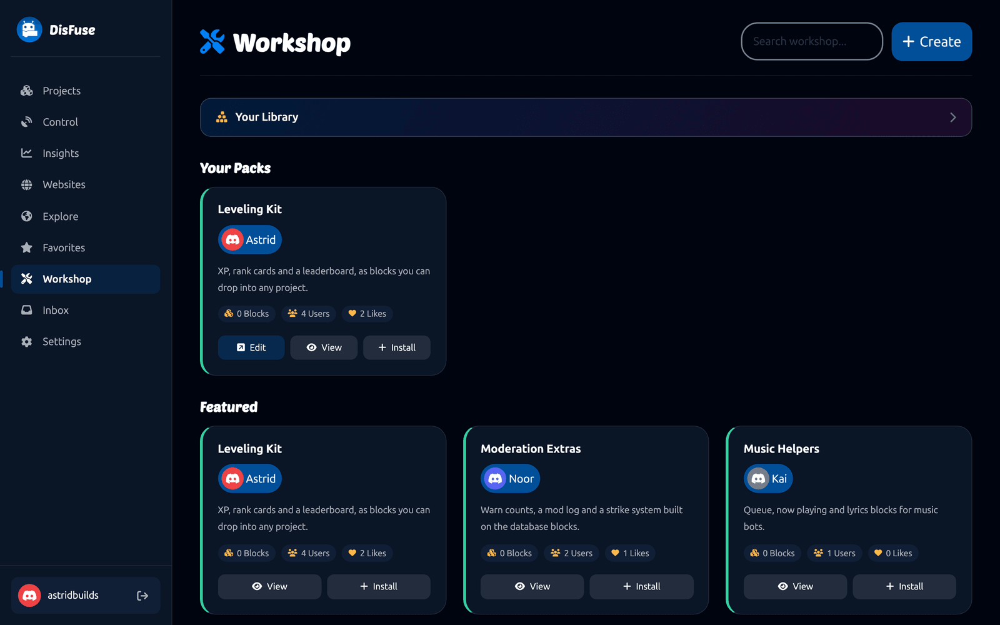
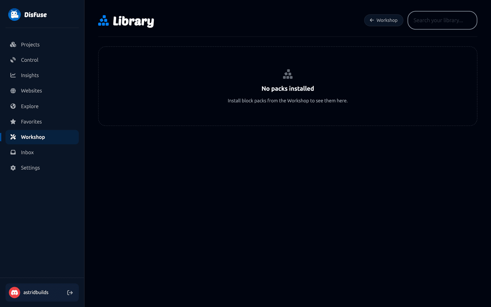

# Workshop

The Workshop is where people build and share **block packs**: sets of custom blocks that anybody can install into their own project.

If you keep rebuilding the same thing across projects, or you want to give other people a feature without giving them your whole bot, a block pack is the answer.

## Finding packs

**Workshop** in the dashboard lists what is available. Search by name, or browse the featured packs.

Each card shows the author, the description, how many blocks it has, how many people use it, and how many likes it has. Click **View** to see the pack's page, or **Install** to add it to your account.

## Installing

Click **Install** on a pack. It goes into **Your Library**.

Open any project and the pack's blocks appear under **Workshop** in the toolbox, in their own subcategory. Use them exactly like DisFuse's own blocks.

Packs are versioned. When an author releases a new version, you choose whether to move to it, so a change on their side cannot break your bot without warning.

## Uninstalling

Remove a pack from Your Library and its blocks leave your toolbox.

:::warning
Uninstalling a pack a project already uses leaves that project with blocks nothing recognizes. Take the blocks out of the project first, or leave the pack installed.
:::

## Building a pack

Click **Create** on the Workshop page. Give the pack a name, a color and a description, and choose whether it is private.

You are then in the **Workshop editor**, a block editor for building blocks. It works like the project editor, but the blocks you drag define *other* blocks.

### Defining a block

Start with `new block named:` and fill it in:

| Setting | What it decides |
| --- | --- |
| **Inputs** | The holes and text your block shows. |
| **Type** | Whether it is an action, a value, or a hat. |
| **Output type** | What kind of value it produces, for a value block. |
| **Previous and next statement** | Whether it stacks above and below other blocks. |
| **Description** | The tooltip. |
| **Help URL** | Where the question mark icon leads. |
| **Color** | The block's color. |
| **Output code** | The JavaScript it generates. |

### Inputs

| Input | What it gives you |
| --- | --- |
| **Value input** | A hole another block plugs into. |
| **Statement input** | A slot that holds a stack of blocks. |
| **Dummy input** | A row of text and fields, with no hole. |
| **End-row input** | The same, forcing a line break. |

Each input can carry **fields**: labels, text boxes, dropdowns, checkboxes, number boxes, color pickers and image fields. That is how you get an editable box or a dropdown on your block.

Set a **check** on a value input to restrict what may plug into it, using the type blocks. That is what makes DisFuse refuse to put a channel where a member belongs.

### Output code

The output code is the JavaScript your block turns into. Three blocks read what the user put in:

- `get value input with name` gives you the code from a value input.
- `get statement input with name` gives you the code from a statement input.
- `get field value with name` gives you what is typed or selected in a field.

Build the generated code around those.

### Previewing

The Workshop editor has a preview alongside your definitions, so you can see the block as you build it.

## Publishing a version

When the pack works, publish a version. Give it a version number and a changelog saying what changed.

Existing users are not moved automatically. They see there is a new version and choose when to take it.

Keep the pack **private** while you are building. Make it public when it is ready for other people.

## Writing a pack worth installing

- **Do one thing.** A pack called "Leveling Kit" is easier to trust than one called "My Blocks".
- **Name blocks the way DisFuse does.** Lowercase, readable as a sentence: `give xp to member`, not `giveXP`.
- **Set checks on inputs.** It is the difference between a block that guides people and one that lets them make a mess.
- **Write descriptions.** They become the tooltip, and it is the only documentation most people will read.
- **Say what changed** in every changelog.

## Dependencies

A pack can depend on another pack. Installing yours then installs the one it needs. Use it when you genuinely build on somebody else's blocks, rather than copying them.
