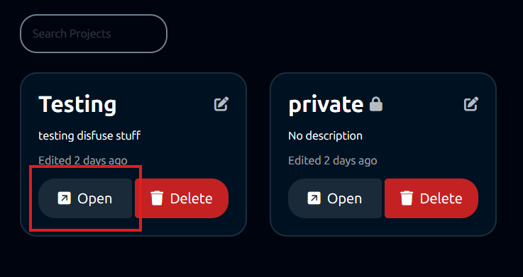
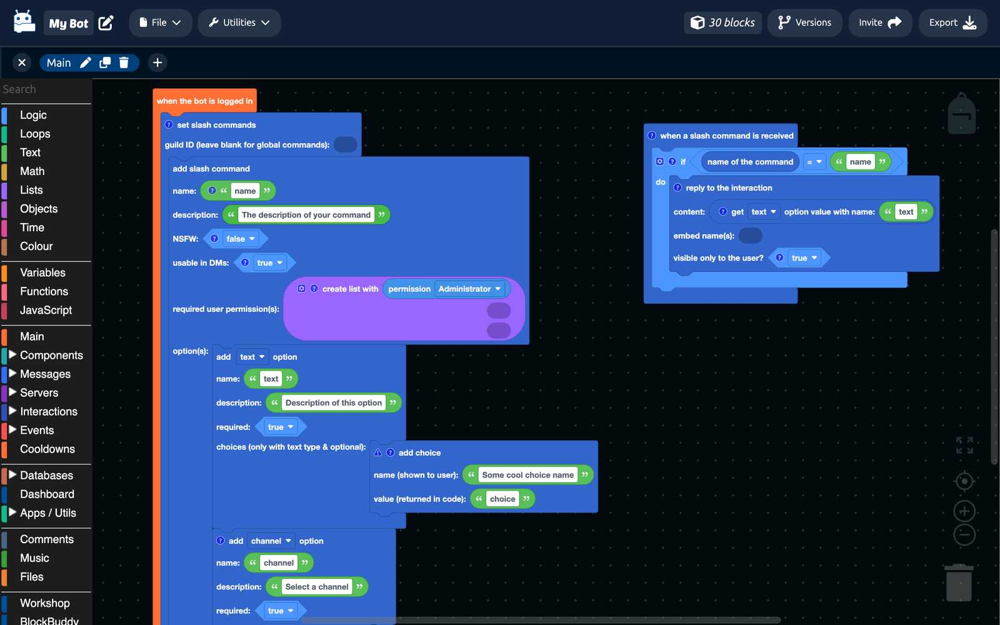
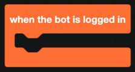

# Coding Your Bot

Your project exists and your bot is set up. Now for the part that makes it do something.

## Open your project

Go to **Projects** in the dashboard and click **Open** on your project.

## What you are looking at

Three things matter to start with:

- The **toolbox** down the left, holding every block DisFuse has.
- The **canvas** in the middle, where you build.
- The **toolbar** across the top, with File, Utilities, Versions, Invite and Export.

[The Editor](the-editor.md) covers all of it in detail.

## Your first blocks

Every bot needs one block before anything else: the ready event.

1. Click **Main** in the toolbox.
2. Drag `when the bot is logged in` onto the canvas.

Everything that has to happen as soon as your bot connects goes inside it. That is where you register slash commands and set the bot's status.

:::info
There is no "log in with token" block any more. Your bot token lives in [project settings](project-settings.md), so it can never end up in a screenshot of your blocks or in a project you shared. If you are following an older tutorial that tells you to drag a token block, skip that step.
:::

## Making a command

The shortest path to a working bot is a slash command.

1. Open **Interactions**, then **Slash**.
2. Drag `create slash commands / context menus` inside `when the bot is logged in`.
3. Put your test server's ID in the test guild field while you are building, so commands appear straight away.
4. Drag `add slash command` inside that, and give it a name and a description.
5. Drag `when a slash command is received` onto the canvas, on its own.
6. Inside it, check `name of the command` matches yours with an `if` block from **Logic**.
7. Inside the `if`, use `reply to the interaction` from the same category, with a text display holding your reply.

[Slash Commands](../Interactions/slash.md) walks through this in full, with screenshots of every block.

:::tip
`Utilities > Templates` loads a working slash command setup into your workspace, so you can see the shape before building your own. See [Templates](templates.md).
:::

## Where things are

| You want to | Look in |
| --- | --- |
| Send a message | [Channels](../Blocks/Servers/channels.md), then build it with [Components](../Blocks/Components/components.md) |
| React to somebody joining | [Server Actions](../Blocks/Events/server-actions.md) |
| Ban, kick or time out a member | [Members](../Blocks/Servers/members.md) |
| Give somebody a role | [Roles](../Blocks/Servers/roles.md) |
| Remember something between restarts | [Databases](../Blocks/Databases/simple.md) |
| Add a button | [Buttons](../Blocks/Components/buttons.md) |
| Talk to another website | [Fetch](../Blocks/Apps/fetch.md) |

The [Blocks](../Blocks/using-blocks.md) section has a page for every category.

## Saving

DisFuse saves as you work. The toolbar shows the state: saving, saved, or an error if something went wrong.

If you want a snapshot you can come back to, use [Version Control](version-control.md).

## Checking your work

`File > Show Code` shows the JavaScript your blocks produce.

You do not need to understand it to use DisFuse. It is useful for two things: confirming a block does what you expected, and giving somebody in the support channel something concrete to look at.

## Next

When your bot does something worth seeing, [export it and run it](running-your-bot.md).
