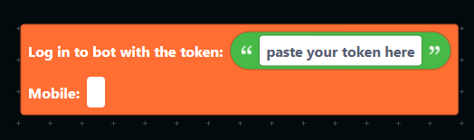

# Coding Your Bot

The code is the main thing of your bot. Without it, your bot would not respond or have commands.

Let's take a look at how to make your bot's features in Disfuse.

## Setup your project

First, open your project by going into the dashboard -> projects, and click the "Open" button on your project.

Once you've opened your project, enter a name for your first workspace.

    
What are workspaces?

    DisFuse allows you to create multiple workspaces within a project. This is useful for organizing your code and separating different features of your bot. Think of it like having different folders in your computer, but for your bot's code.

    When exporting, you can choose to export all of the workspaces together or just one.

## How to use blocks

Once you've setup your first workspace, you will see an area where you can place blocks, and a toolbar on the left side, containing all the blocks you can use.

Each block has a specific function, and you can use them to create your bot's features. To start, look through the blocks and find the ones that you think you will need for your bot.
You can drag and drop the blocks into the workspace area to place them.

## Logging into your bot

To start, we need to go into the "Main" section of the toolbar and drag the block "Log in to bot with the token" into the workspace.

You can find your bot's token in the Discord Developer Portal, under the "Bot" tab.

:::info
If you have not created a bot using the Discord Developer Portal, follow this guide: [Creating a bot](/docs/guide/creating-a-bot)
:::

:::warning
You should treat your bot token like a password. Anyone who has your token will be able to control your bot, so you should not share it with anyone besides other developers of the bot.
:::

This block is required for all projects, in order to log into your bot. In the text box, you have to enter your bot's token. However, there are two ways of doing this:

### Option 1: Secured Token

**This option is highly recommended for public projects.**

In order to safely store your bot's token in public projects, you need to create a "secret".

In the top bar, click `Utilities -> Secrets` to open the secrets panel.

Secrets are not visible to anyone besides the owner of the project, even if you share the project with other collaborators. This is the safest way to store your bot's token.

In the "name" field, enter a name for your secret, such as "token". In the "value" field, enter your bot's token. Then, click the "Add secret" button.

Once you've created the secret, you need to use the `get secret with name` block, from the `main` category, and insert it into the `log in to bot with the token` block. Enter the name of the secret you created in the text box.

This will get the secret's value and use it to log in to your bot.

### Option 2: Unsecured Token

**This method should only be used for private projects.**

This method is much simpler, but it should not be used for public projects because it will allow anyone to see your bot's token. To use this method, simply enter your bot's token into the text box of the `log in to bot with the token` block.

