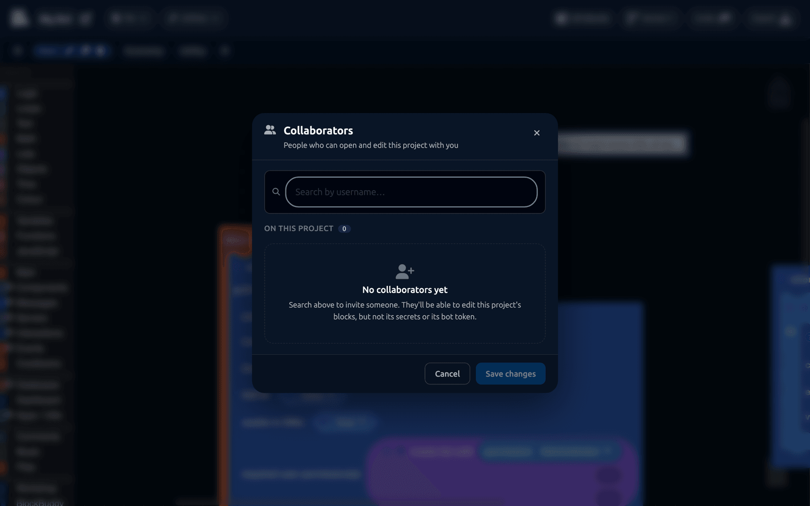

# Collaboration

More than one person can work on a project at once. Everyone sees everyone else's changes as they happen, in the same way a shared document works.

## Inviting somebody

Click **Invite** in the editor toolbar.

Search for their DisFuse username, click them to add them, then click **Save changes**. They get a notification in their [inbox](../Features/inbox.md) and the project appears in their Projects list.

Only the project owner can invite or remove collaborators.

## What a collaborator can do

| Can | Cannot |
| --- | --- |
| Open the project and edit its blocks | See or change [secrets](secrets.md) |
| Create, rename and delete workspaces | See or change the bot token |
| Use [Version Control](version-control.md), if the owner has Premium | Invite other collaborators |
| Export the project | Change project settings or visibility |
| | Delete the project |
| | Use [Insights](../Features/insights.md) or [Control](../Features/control.md) on the bot |

The restrictions are enforced by DisFuse's servers, not just hidden in the interface. A collaborator's browser is never sent the token or the secret values at all.

## Working at the same time

While two people have the project open:

- Their avatar appears in the toolbar. Click it to see who is in.
- Their cursor and the block they have selected are shown on the canvas with their name.
- Every change saves and appears for everyone within a moment.

There is no merge step and no conflict to resolve, because you are both editing the same live workspace.

:::tip
Agree on who is working where before you start. Two people rearranging the same stack of blocks will get in each other's way, but two people in different [workspaces](workspaces.md) never will.
:::

## One tab at a time

A project can only be open in one browser tab per person. Opening it in a second tab takes over from the first, and the first is told what happened.

If you reload, DisFuse recognizes it is the same tab and hands the session straight back.

## Removing somebody

Open the Invite panel, remove them from the list, and save. They lose access immediately, including anyone who has the editor open right now.

## Losing connection

If your connection drops, the toolbar shows **Reconnecting** and your changes are held until it comes back. It reconnects on its own; there is nothing to click.

If it says **Error** instead, reload the page. Anything saved before the error is safe.

## Working alone but on two machines

You do not need to invite yourself anywhere. Log in on the other machine and the project is there. Just do not leave the editor open in both places at once, or one will take over from the other.
