# Creating a Discord Bot

In order to start creating your bot's code in DisFuse, you must first create your Discord bot's account. Lets go over the basic steps to create your Discord bot!

## Create an application

First, go to the Discord Developer Portal, then log in using your Discord account.
Once you are logged in, a tab named "Applications" will appear. Click on the button named "New Application".

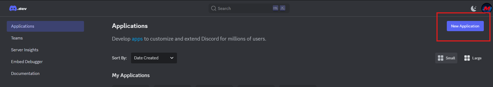

Once you click on the button, a popup named "Create An Application" should appear.

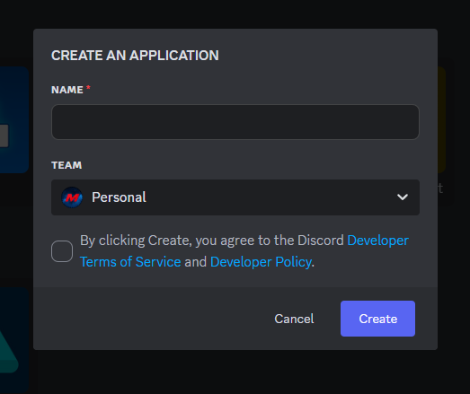

In the "Name" field, type the name for your Discord Bot, and select a team.
If you're not sure what the "team" means, you can just leave it blank or whatever is already selected.

Congrats! You have created your first Discord Bot.

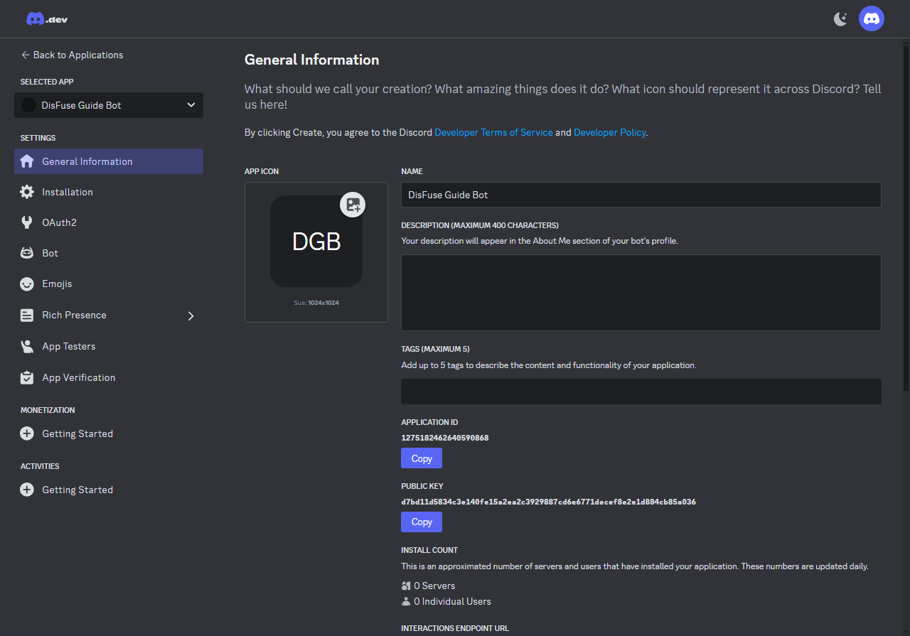

## Set Up Your Bot

Now, go to the "Bot" tab of your Discord bot.

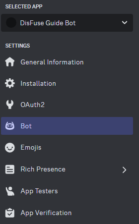

Scroll down until you see "Privileged Gateway Intents", in which you will enable the intents for your Bot. For now, let's enable all of them.

:::warning
This step is required for your bot to be run on DisFuse
:::

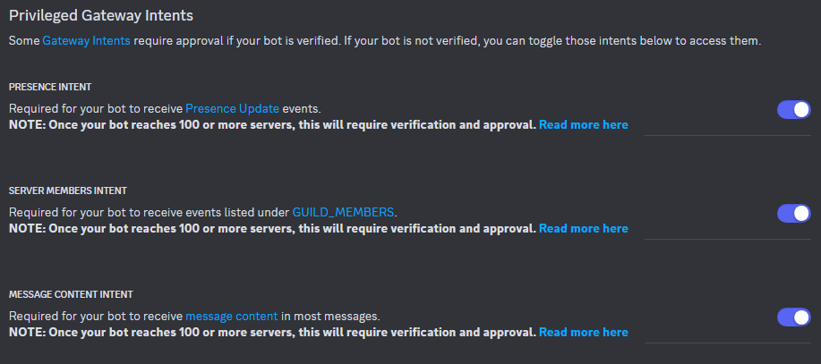

**Once you've done that, save your changes.**

### Change Bot Information

In this tab, you can also set a profile picture, banner, or username for your bot.

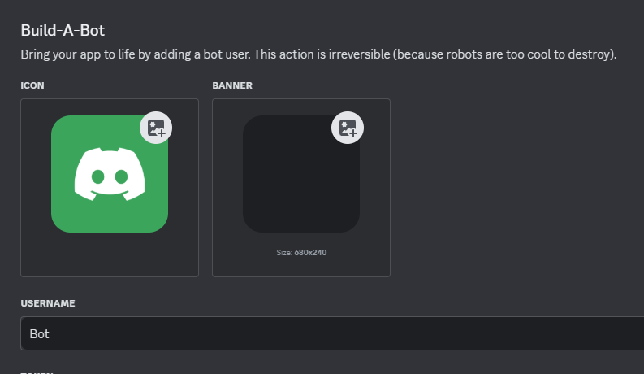

## Generate an invite link

Now that you have created your first Discord Bot, go to the "OAuth2" tab in order to create a link for users to add your bot to servers.

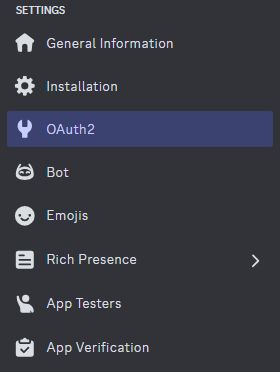

Scroll down until you see "OAuth2 URL Generator" then on "Scopes", check the boxes named "Bot" and "applications.commands"

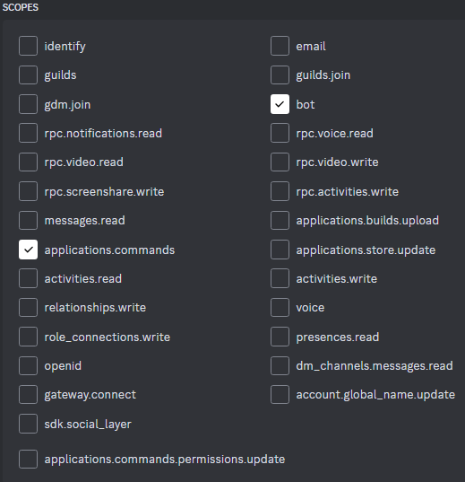

A new tab named "Bot Permissions" will appear. Select on the permissions your bot will use.

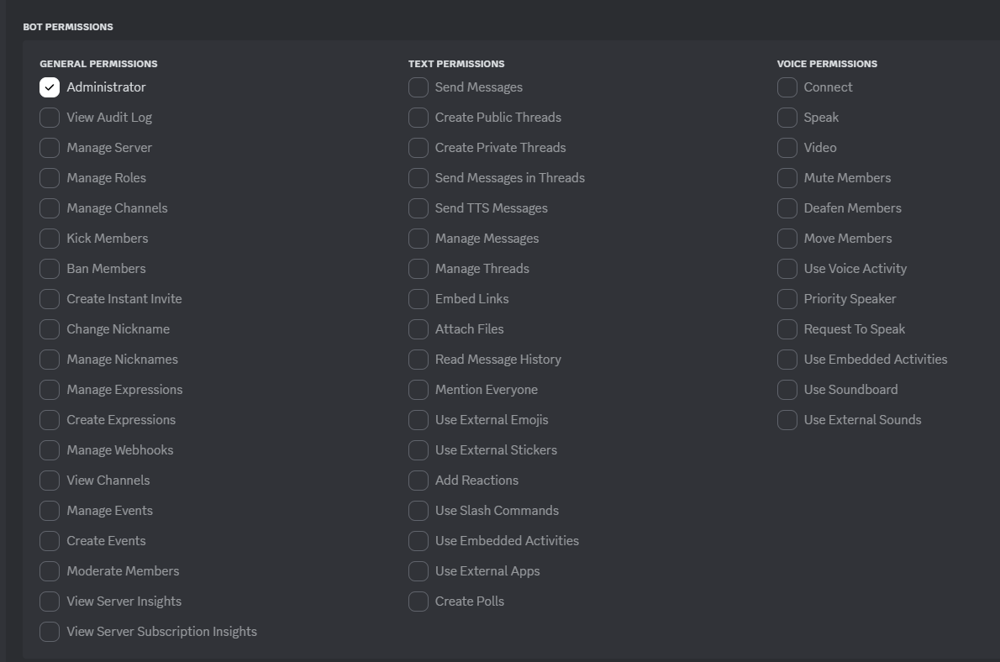

Once you've done that, scroll down until you see "Generated URL" which is located at the bottom, and click on the "Copy" button.
When you've copied the URL generated, paste it in your browser's toolbar.

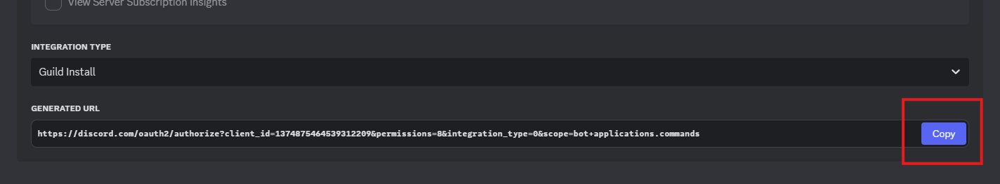

After you've visited the new link, you will see a prompt asking you to select a server to add your bot to.

You're probably familiar with this page if you've ever added a bot to a server before.

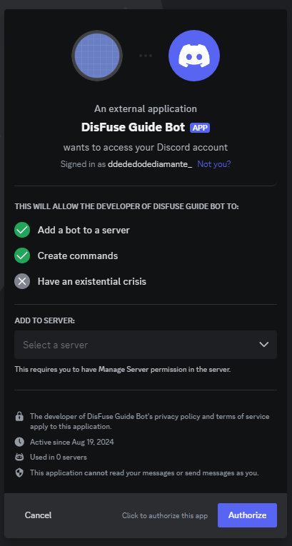

Follow the instructions to select a server to add your bot to.

Once you've added your bot to a server, your bot is all set! You can now create a project on DisFuse to start making commands and features for your bot.
