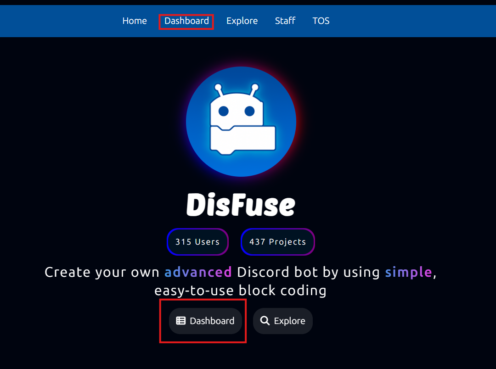
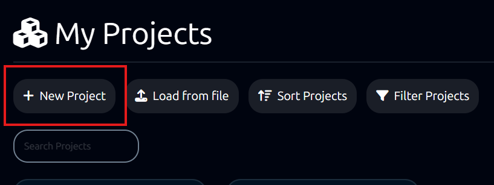

# Creating a DisFuse Project

Once you have your Discord bot all set up, you can create a DisFuse project and start making your bot's features.

## Log in to DisFuse

If you haven't already, you need to go to the [DisFuse website](https://www.disfuse.xyz), and click the "dashboard" button.

This will take you to Discord, prompting you to authorize DisFuse to access your account's username and profile picture.
This is necessary to be able to use DisFuse.

## Create a new project

Once you have logged in, it will take you to your DisFuse dashboard. You can create a new project by clicking the "New Project" button.

Next, you will have to enter some information about the project, like the project name, description, and the visibility.

  
The differences between public and private projects

If your project is private, other users will not be able to see your project anywhere on the website.

If your project is public anyone will be able to see your project info and bot code. Users can also like, favorite, clone, and comment on your project.

:::warning
If you make your project public, you will need to hide your bot token or any other sensitive information using secrets (environment variables)
:::

Once you complete the steps to setup your project, will be redirected to your new project's workspace, where you can start using blocks to make your bot's features.
