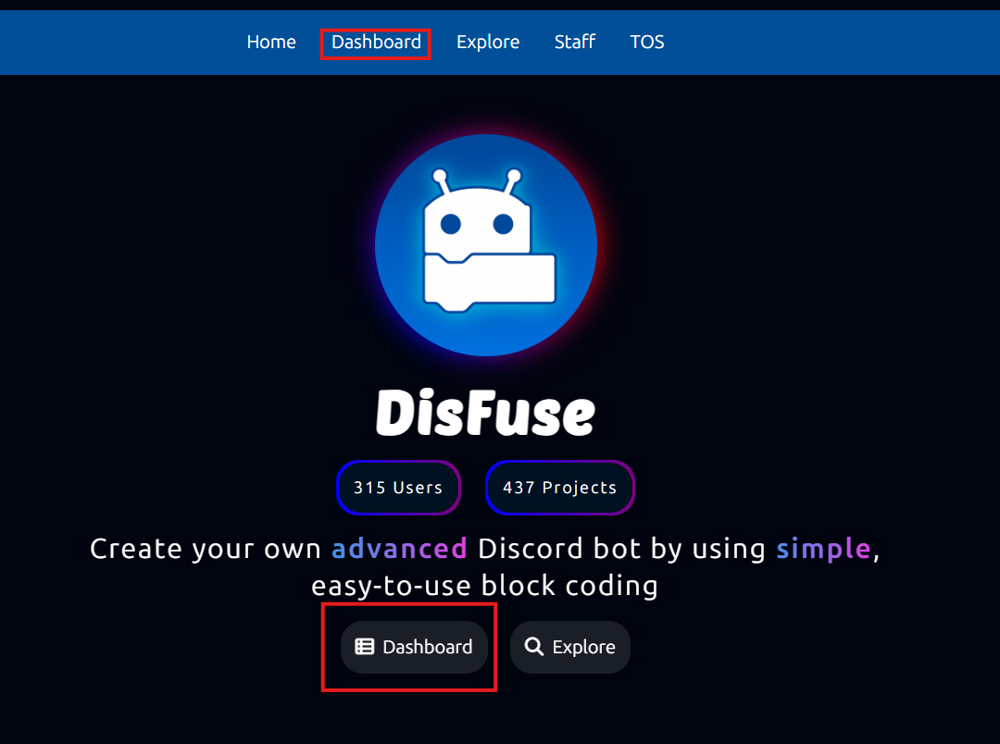
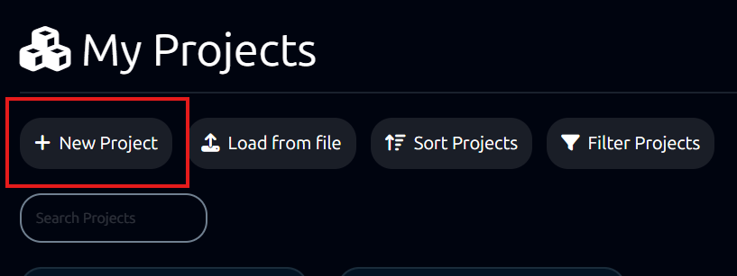
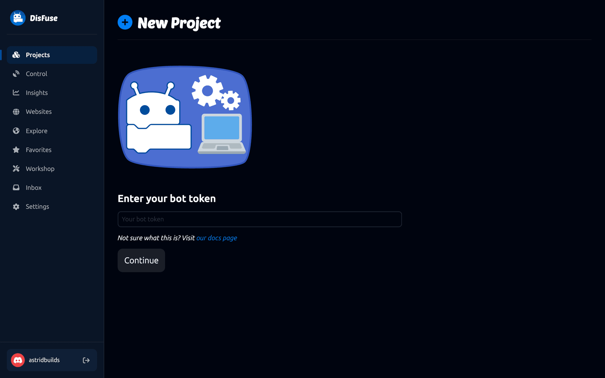
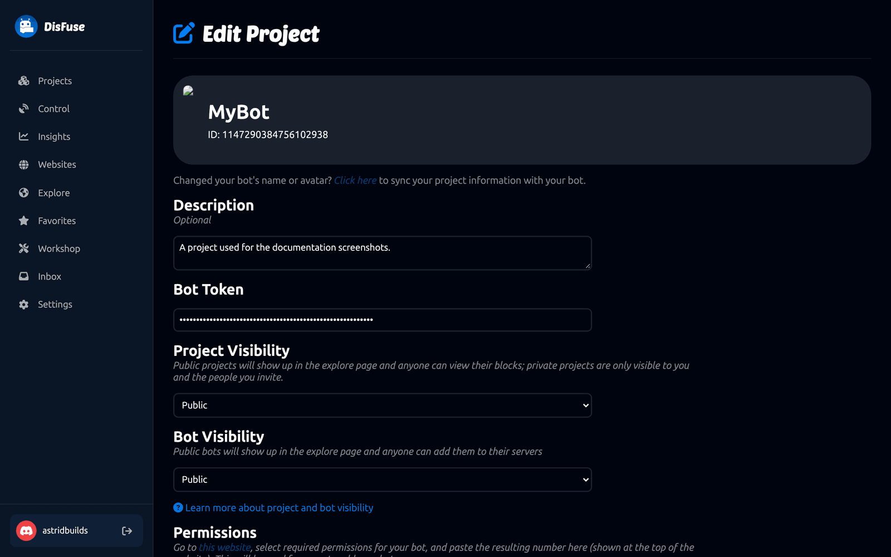
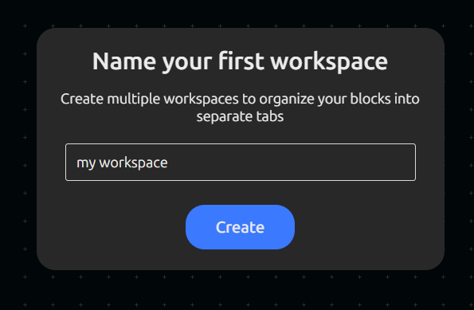

# Creating a DisFuse Project

Once your Discord bot exists, a DisFuse project is where you build what it does. One project is one bot.

## Log in to DisFuse

Go to the [DisFuse website](https://www.disfuse.xyz) and click the **Dashboard** button.

Discord will ask you to authorize DisFuse to see your username and profile picture. That is all DisFuse asks for, and it is required to use the site.

## Create a new project

You land on your dashboard. Click **New Project**.

### Step 1: your bot token

DisFuse asks for your bot token first, and uses it to look your bot up on Discord. That is how the project knows your bot's name, avatar and ID without you typing them.

Your token is in the Discord Developer Portal, under the **Bot** tab of your application. If you have not made a bot yet, follow [Creating a Discord Bot](creating-a-bot.md) first.

:::warning
Treat your bot token like a password. Anyone who has it can control your bot completely. DisFuse stores it with the project and never shows it to collaborators, but you should still never paste it into a Discord message or a screenshot.
:::

### Step 2: project details

| Field | What it does |
| --- | --- |
| **Description** | Shown on your project page. Optional. |
| **Project visibility** | Public projects appear on Explore and anyone can read their blocks. Private projects are visible only to you and people you invite. |
| **Bot visibility** | Public bots appear on Explore with an "Add Bot" button, so other people can invite your bot to their server. |
| **Permissions** | The permissions number used in your bot's invite link. Pick the permissions you need on [discordapi.com/permissions.html](https://discordapi.com/permissions.html) and paste the number it gives you. |

  
Public or private?

**Private** keeps everything to yourself. Nobody can see your project, its blocks, or its bot on DisFuse.

**Public** puts your project on the Explore page. Other people can view your blocks, like the project, comment on it, add it to their favorites, and clone it into their own account.

Your bot token and your [secrets](secrets.md) are never public, whatever you choose. Only the blocks are.

Project visibility and bot visibility are separate. A public project with a private bot lets people read your code without adding your bot to their server.

Click **Create Project**, and DisFuse takes you into the editor.

## Naming your first workspace

The first time you open a project you are asked to name a workspace. A workspace is a tab, and a project can have as many as you like.

"Main" is a fine name to start with. See [Workspaces](workspaces.md) for what to do with more of them.

## What to do next

- [Learn your way around the editor](the-editor.md)
- [Build your first slash command](../Interactions/slash.md)
- [Store your API keys as secrets](secrets.md)
- [Change your project settings later](project-settings.md)
