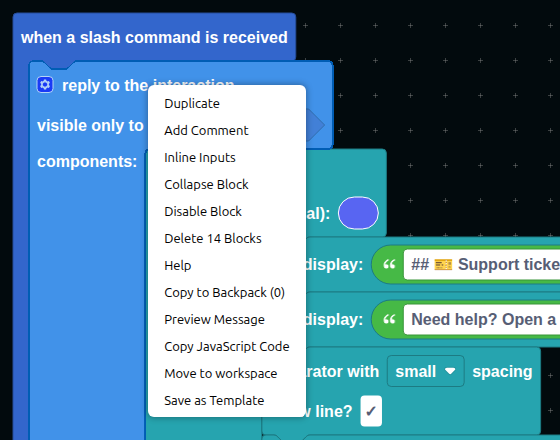
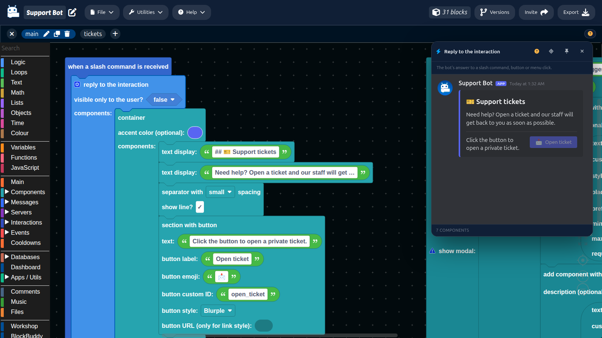
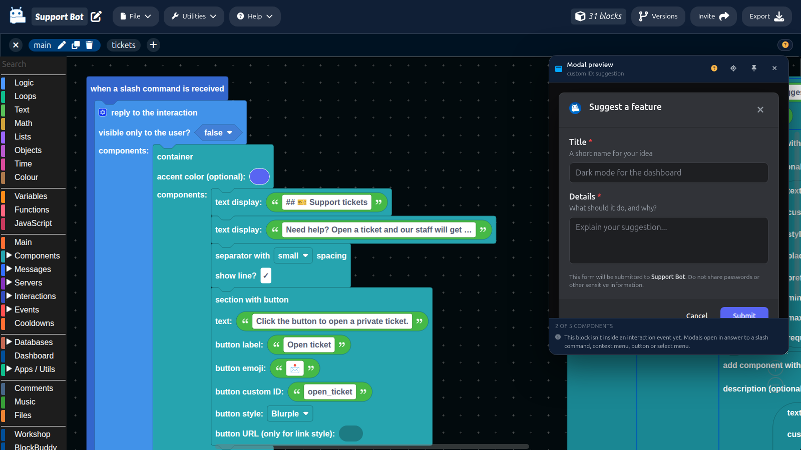

# Message and Modal Previews

You do not have to run your bot to see what a message or a modal will look like. Right-click the blocks that build one and DisFuse draws it the way Discord will, right next to your blocks.

## Previewing a message

Right-click a block that sends a message, or any block inside one, and choose **Preview Message** (or **Preview This Message** on a block inside it).

A panel opens showing the message as your bot will send it, with its containers, text, separators, buttons, menus, images and files.

The preview works with every block that sends a [Components V2](componentsV2.md) message: sending in a channel, sending a DM, replying to a message, and replying to or editing an interaction reply. The header says which one it is and where the message goes.

## Previewing a modal

Right-click `show modal`, `create modal`, or anything inside one, and choose **Preview Modal**.

The panel draws the form with its title, labels, descriptions, text inputs, menus, checkboxes and file uploads. If `show modal` takes its modal from a variable, the preview shows whatever that variable was set to. See [Modals](../Interactions/modals.md).

## Things you cannot know yet

Some values only exist once the bot runs: a variable, the member who used a command, the result of a database read. The preview cannot guess those, so it shows them as a **placeholder** chip naming the block that will fill it in.

## The preview panel

| Control | What it does |
| --- | --- |
| **?** | Opens these docs. |
| **Find this block** | Scrolls the canvas to the block being previewed. |
| **Follow / pin** | By default the preview follows whichever message (or modal) block you select. Pin it to keep showing one while you work elsewhere. |
| **×** | Closes the panel. `Escape` does too. |

Drag the header to move the panel and the corner to resize it. DisFuse remembers where you left it.

Under the preview, a footer counts the components (for a modal, out of the five it can hold) and lists anything worth knowing, like a media gallery with no images, a modal outside an interaction event, or a block the preview cannot draw.

:::tip
Leave the preview open while you edit. It updates as you change the blocks, so you can adjust text and layout and watch the result straight away.
:::
