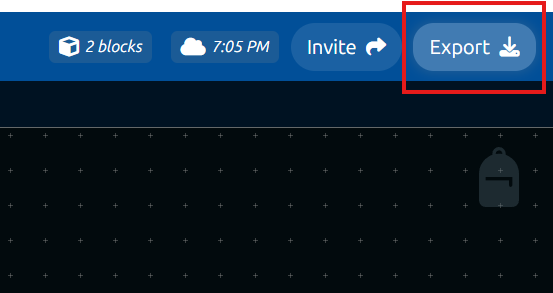

# Running Your Bot

## What is hosting?

DisFuse provides the files for your bot after you create features using blocks, but, for a bot to be online, those files must be ran. The bigger and more used your bot, the more computer power you'll need. Most hosting services cost money; there are free alternatives, but each has its own limitations.

## Hosting services

Here are some examples of **free** hosting services which you can use to run your bot files:

> https://solarhosting.cc
>
> https://fps.ms
>
> https://discloud.com

If you are willing to pay money to run your bot, there are much more reliable options to choose from:

> https://replit.com
>
> https://heroku.com

## Export your bot

When you want to start running your bot, click the export button to download the bot files.

:::info
If you change or add anything to your bot, you will have to re-export the files and upload them to your hosting service again.
:::

You will have the option to choose whether you want to export your whole project, or a single workspace. If you choose to export a single workspace, make sure you have a `log in to bot with token` block in that workspace, or else the bot won't be able to run.

---

Once you have exported your bot, you can unarchive the downloaded `zip` file, and upload the new files to your hosting service.

**Since every hosting service is different, you will have to find out the exact process of setting up your bot on your chosen hosting service.**

If you need help getting your bot online, please [join our Discord server](https://dsc.gg/disfuse) and create a post in #support, and we can help you with a specific hosting service, or any other issue you might have.
