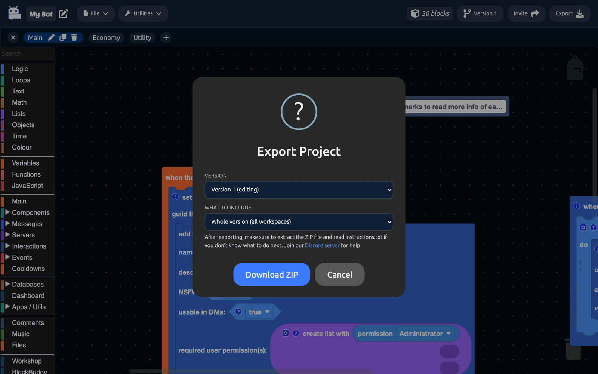

# Running Your Bot

DisFuse writes your bot's code. Something has to run it, and that something is a host: a computer that stays on, all the time, with your bot's files on it.

## Export your bot

Click **Export** in the editor toolbar.

You choose two things:

- **Version**, if your project uses [Version Control](version-control.md).
- **What to include**: the whole version, with every workspace, or just the one you are looking at.

Export the whole thing unless you are deliberately testing one workspace on its own.

Click **Download ZIP**.

:::info
The exported files are a snapshot. Change your blocks and you have to export again and re-upload, or your host keeps running the old code.
:::

### What is in the ZIP

| File | What it is |
| --- | --- |
| `index.js` | Your bot, as JavaScript. |
| `package.json` | The list of libraries it needs. |
| `.env` | Your bot token and your [secrets](secrets.md). |
| `instructions.txt` | A short guide to getting it running. |

:::danger
The `.env` file contains your real bot token. Never upload the ZIP anywhere public, never put it in a GitHub repository, and never send it to somebody who should not be able to control your bot.
:::

## Choose a host

Your bot needs [Node.js](https://nodejs.org), version 18 or newer.

**Free hosts.** Fine for testing and small bots. Expect limits: they may sleep when idle, cap your memory, or wipe files on restart.

> [wispbyte.com](https://wispbyte.com)
>
> [solarhosting.cc](https://solarhosting.cc)
>
> [fps.ms](https://fps.ms)
>
> [discloud.com](https://discloud.com)

**Paid hosts.** More reliable, and worth it once people depend on your bot.

> [wispbyte.com](https://wispbyte.com) (paid plans)
>
> [replit.com](https://replit.com)
>
> [heroku.com](https://heroku.com)
>
> Any VPS provider, if you are comfortable with a terminal.

:::warning
If your bot uses the [Databases](../Blocks/Databases/simple.md) or [Files](../Blocks/files.md) blocks, check that your host keeps files between restarts. Some free hosts do not, and your data will vanish every time the bot restarts.
:::

## Get it running

Every host is different, but the shape is always the same:

1. Unzip the download.
2. Upload the files to your host.
3. Install the dependencies. Most hosts do this for you; otherwise run `npm install`.
4. Set the start command to `node index.js`, or `npm start` if your host prefers it.
5. Start it.

Some hosts ignore `.env` files and want environment variables set in their own panel. If your bot starts but the token is missing, that is the reason. Copy each name and value across by hand.

## Checking it worked

Your bot's status in Discord turns from offline to online. If you set a presence with the [Main](../Blocks/main.md) blocks, it appears under the name.

If it does not come online, read your host's console. The error is almost always in the first few lines.

| Message | Means |
| --- | --- |
| `An invalid token was provided` | The token in `.env` is wrong or has been reset. |
| `Used disallowed intents` | Privileged intents are off in the Discord Developer Portal. See [Creating a bot](creating-a-bot.md). |
| `Cannot find module` | The dependencies were not installed. Run `npm install`. |
| Nothing at all | The start command is wrong, or the host is not running it. |

More in [Troubleshooting](../Help/troubleshooting.md).

## Keeping it running

- **Re-export after every change**, and re-upload. There is no automatic deployment.
- **Watch the console** after an update. A bot that starts fine can still fail on the first command.
- **Use [Insights](../Features/insights.md)** to see what your bot is actually doing across every server it is in, without reading logs.
- **Use [Control](../Features/control.md)** to act as your bot from the DisFuse website.

## Getting help

If your bot will not start, [join the DisFuse Discord server](https://dsc.gg/disfuse) and post in the support channel. Include the error from your host's console and the name of the host. That is usually enough for somebody to spot it immediately.
