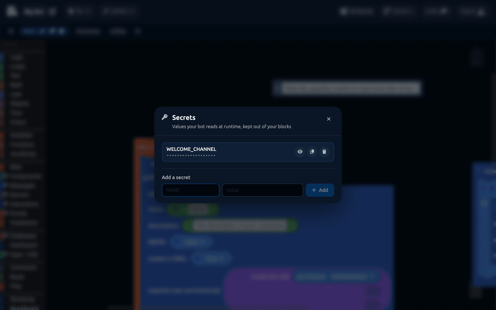

# Secrets

A secret is a value your bot uses but nobody should see: an API key, a webhook URL, a database password. Secrets are stored with your project, hidden from everyone but you, and written into a `.env` file when you export.

## Opening the panel

Click `Utilities > Secrets` in the editor toolbar.



Type a name and a value, then click **Add**. The name is what you use in blocks; the value is never shown again, only masked. Use the eye icon to reveal one, the copy icon to copy it, and the bin to delete it.

:::info
Only the project **owner** can see or change secrets. Collaborators can use them in blocks, but the panel is closed to them and the values are never sent to their browser.
:::

## Using a secret


`get secret with name` in the [Main](../Blocks/main.md) category reads one. Give it the exact name you used when adding it.

The block produces text, so plug it wherever the value is needed: a header in a [Fetch](../Blocks/Apps/fetch.md) request, a channel ID, a webhook URL.

## What belongs in a secret

| Put in a secret | Leave in blocks |
| --- | --- |
| API keys and tokens | Command names |
| Webhook URLs | Message text |
| Database connection strings | Cooldown durations |
| Private channel IDs, if the project is public | Public channel names |

Your **bot token** is not a secret. It lives in [project settings](project-settings.md) and DisFuse handles it for you.

## Naming

Use capital letters and underscores: `WEATHER_API_KEY`, `LOG_WEBHOOK`, `MONGO_URI`. That is the convention for environment variables, and it makes them easy to spot in the exported `.env`.

The name is case sensitive. `weather_key` and `WEATHER_KEY` are different secrets.

## What happens on export

When you export, DisFuse writes a `.env` file into the ZIP containing your bot token and every secret, one per line:

```
token=your-bot-token
WEATHER_API_KEY=abc123
LOG_WEBHOOK=https://discord.com/api/webhooks/...
```

`get secret with name` becomes a read of that file at runtime.

:::danger
The exported ZIP contains your real token and every real secret value. Never share the ZIP, never commit it to a public repository, and never upload it anywhere you would not paste your bot token.

If a secret does leak, change it at the source: regenerate the API key, delete the webhook, reset the token. Deleting it from DisFuse does nothing to a copy somebody already has.
:::

## Hosting

Most hosts have their own place to set environment variables, and some ignore the `.env` file. If your bot starts but every secret comes back empty, that is why. Copy each name and value into your host's environment variable settings.

## Secrets are per project

Secrets belong to a project, not a workspace, so every workspace in the project can read them. They are not shared between projects. Cloning a project does **not** copy its secrets, so a cloned project needs its own.

## A worked example

Using a weather API key safely:

1. `Utilities > Secrets`, add `WEATHER_KEY` with the key as its value.
2. Build a headers object with [Objects](../Blocks/objects.md): key `Authorization`, value `get secret with name WEATHER_KEY`.
3. Pass that object as the `headers` config on a [Fetch](../Blocks/Apps/fetch.md) request.

The key never appears on the canvas, so a screenshot of your blocks or a public project gives nothing away.
