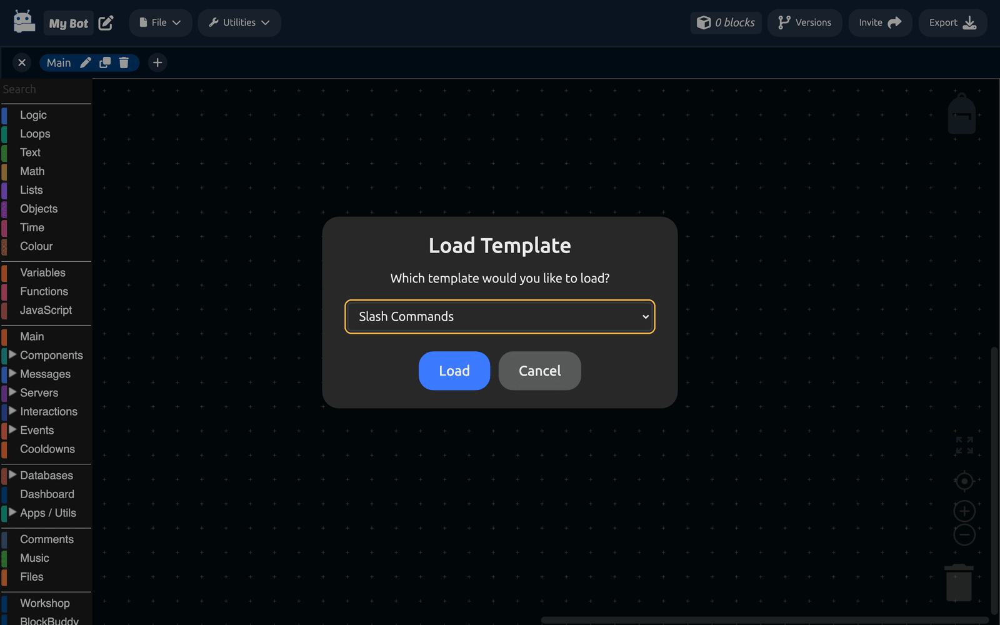

# Templates

A template is a ready-made set of blocks. Loading one drops a working example onto your canvas, which is the fastest way to see how a feature is meant to fit together.

## Loading a template

Click `Utilities > Templates` in the editor toolbar.

Pick one from the list and click **Load**. The blocks are added to your current workspace, alongside anything already there. Nothing is replaced.

## What is available

| Template | What it builds |
| --- | --- |
| **Slash Commands** | Registering a command, receiving it, reading an option and replying. |
| **Ping Command** | A minimal `/ping` that reports the bot's latency. |
| **Economy Commands** | A balance, a daily reward and a database behind them. |
| **Ticket Commands** | A ticket panel with a button, thread creation and a close action. |
| **Context Menu** | Registering a context menu and responding to it. |

## Using one well

A template is a starting point, not a finished feature. After loading:

1. **Read it.** Follow the blocks from the event downward and work out what each one does.
2. **Change the names.** Command names, reply text and IDs are placeholders.
3. **Delete what you do not need.** A template covers more ground than most bots want.
4. **Move it.** Right-click a block and choose **Move to workspace** to put it where it belongs. See [Workspaces](workspaces.md).

:::tip
Load a template into a **new, empty workspace** the first time. You get to read it without it tangling with your own blocks, and deleting the tab afterwards is a single click.
:::

## Templates versus block packs

Templates and [block packs](../Features/workshop.md) solve different problems.

- A **template** gives you blocks that already exist, arranged for you. Once loaded, they are yours to edit.
- A **block pack** gives you new blocks that did not exist before, built by somebody else in the Workshop.

Use a template to learn a pattern. Use a pack to avoid rebuilding one.

## Making your own

DisFuse's template list is fixed, but you have two ways to keep your own starting points:

- **The backpack.** Drag a block arrangement into the backpack in the top right of the canvas, and it is available in every project you open.
- **A template project.** Build a project you never publish, with the pieces you always want, and [clone](../Features/explore.md) it whenever you start something new.
