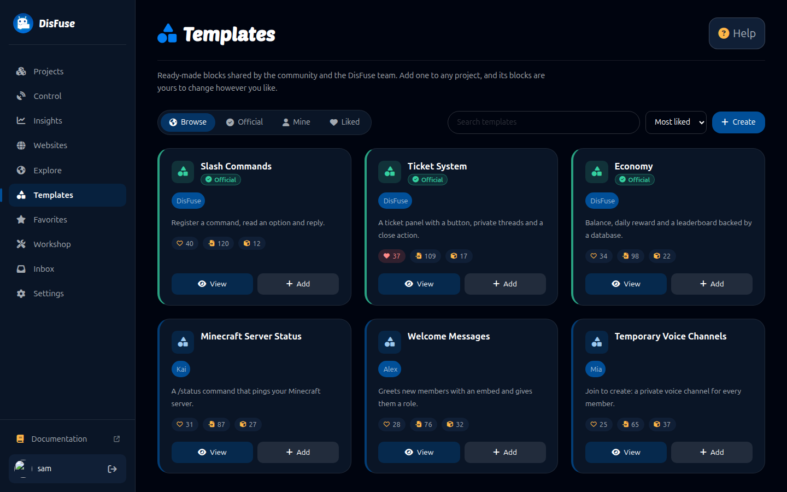
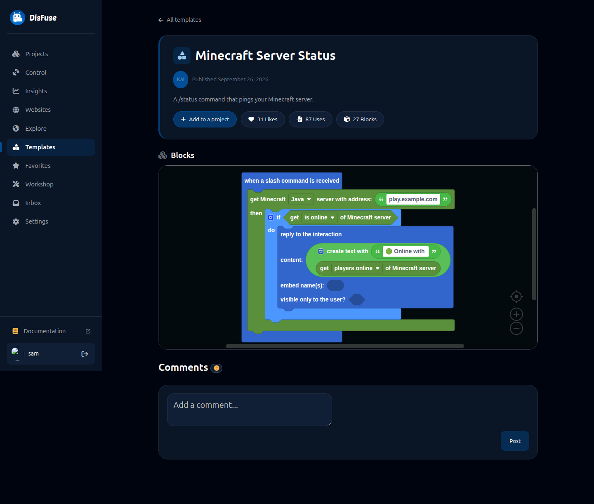
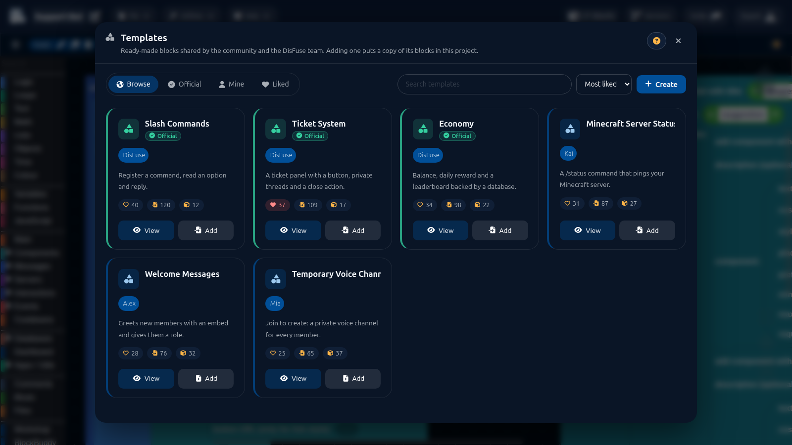
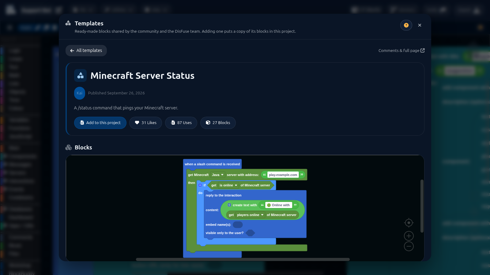
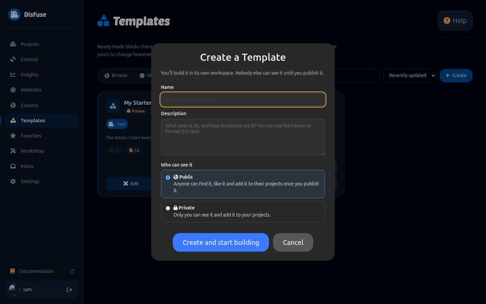
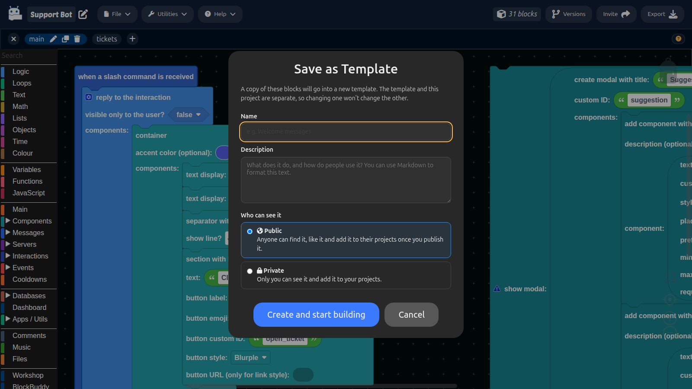
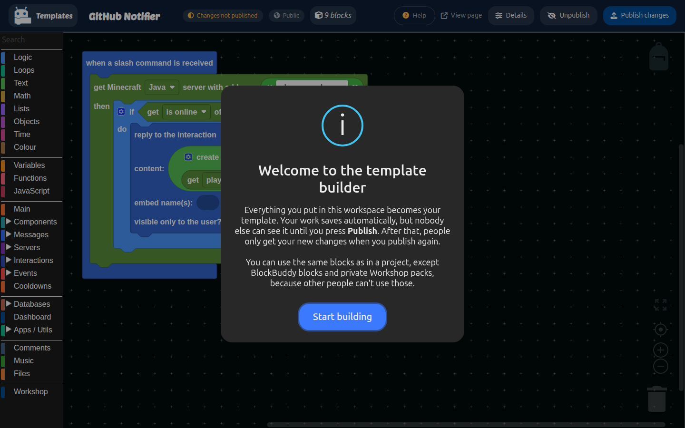
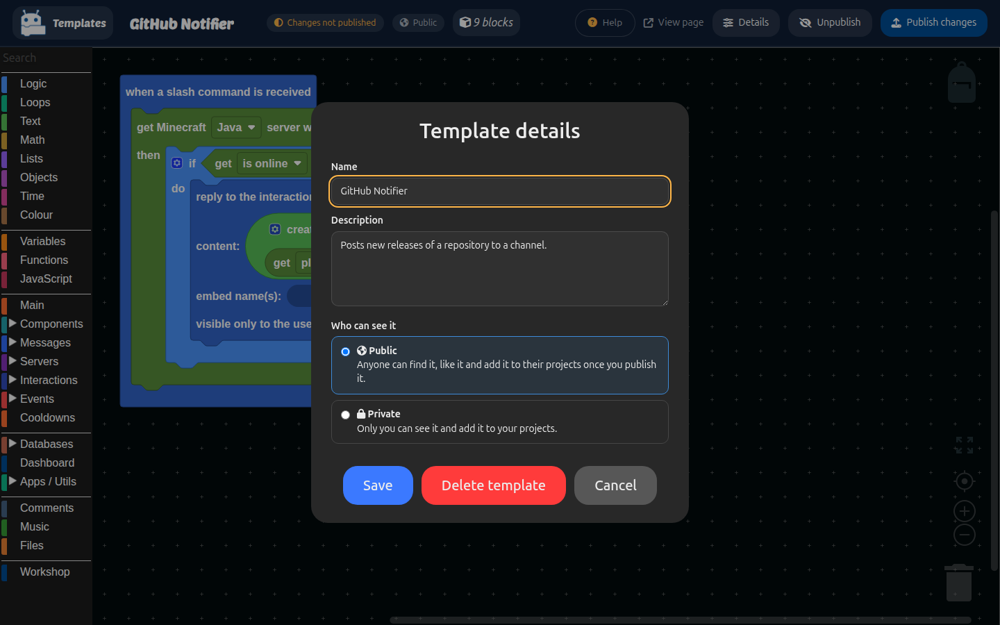
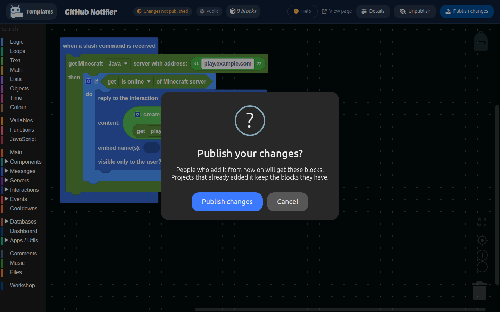
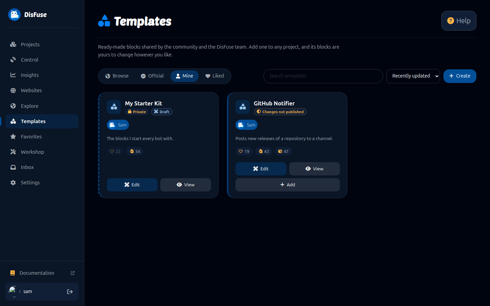

# Templates

A template is a ready-made set of blocks. Adding one drops a working example into your project, which is the fastest way to see how a feature fits together.

Anyone can make templates. The Templates gallery holds the official ones made by the DisFuse team, plus everything the community has published.

## The Templates page

Open **Templates** in the dashboard sidebar.

The tabs along the top filter the gallery:

| Tab | Shows |
| --- | --- |
| **Browse** | Every public template. |
| **Official** | Templates made by the DisFuse team, marked with a green **Official** badge. |
| **Mine** | Templates you made, published or not. |
| **Liked** | Templates you liked. |

Search by name or description, and sort by **Most liked**, **Most used** or **Newest** (and **Recently updated** in Mine).

Each card shows who made it, its description, and how many likes, uses and blocks it has. **View** opens the template's page; **Add** puts it in one of your projects.

## A template's page

The page shows the template's description and a read-only preview of its blocks, so you can see exactly what you are getting before adding it. From here you can:

- **Add to a project**: pick a project, and DisFuse opens it with the template ready to add.
- **Like** it, which helps other people find good templates.
- **Comment** on it, to ask the author a question or say thanks.

## Adding a template in the editor

Click `Utilities > Templates` in the editor toolbar. The same gallery opens inside the editor.

Open one to see its blocks, then click **Add to this project**.

DisFuse asks where the blocks should go:

- **Add to this workspace** puts them on the canvas you are looking at, beside anything already there. Nothing is replaced.
- **Add as a new workspace** puts them in a fresh [workspace](workspaces.md) of their own. Only the project's owner can add workspaces.

**Adding copies the blocks.** They become ordinary blocks in your project, yours to change. If the author edits, unpublishes or deletes the template later, your project is not affected.

If the template uses blocks from a public [Workshop](../Features/workshop.md) pack you do not have, DisFuse tells you and installs the pack for you.

## Using one well

A template is a starting point, not a finished feature. After adding one:

1. **Read it.** Follow the blocks from the event downward and work out what each one does.
2. **Change the names.** Command names, reply text and IDs are placeholders.
3. **Delete what you do not need.** A template covers more ground than most bots want.
4. **Move it.** Right-click a block and choose **Move to workspace** to put it where it belongs. See [Workspaces](workspaces.md).

:::tip
Add a template **as a new workspace** the first time. You get to read it without it tangling with your own blocks, and deleting the tab afterwards is a single click.
:::

## Making your own

### Creating a template

On the Templates page, click **Create**. Give it a name, a description (Markdown works), and choose who can see it.

| Visibility | Who can see and add it |
| --- | --- |
| **Public** | Anyone, once you publish it. |
| **Private** | Only you. Handy for your own starting points. |

### Saving blocks from a project

You can also start a template from blocks you already built. In the editor, right-click a block and choose **Save as Template**, or right-click the canvas and choose **Save Workspace as Template**.

A copy of the blocks goes into the new template. The template and the project stay separate, so changing one never changes the other.

### The template builder

Both ways open the template builder: a workspace just for your template, with the same toolbox as a project.

Your work saves automatically, but **nobody else sees it until you publish**. Across the top:

| Item | What it does |
| --- | --- |
| **Status badges** | Whether it is published, has unpublished changes, and is public or private. |
| **Block count** | How many blocks the template has. |
| **Help** | Opens this page. |
| **View page** | Opens the template's public page. |
| **Details** | Rename it, change the description or visibility, or delete it. |
| **Unpublish** | Takes it off the Templates page. Your blocks stay saved, so you can publish again anytime. |
| **Publish** / **Publish changes** | Makes your current blocks the version everybody gets. |

Publishing replaces the version people add from now on. Projects that already added your template keep the blocks they have.

### What a template cannot contain

A template has to work for anyone who adds it, so two kinds of block are not allowed:

- **BlockBuddy blocks**, because they belong to your account.
- **Blocks from private Workshop packs**, because nobody else could install them. Blocks from public packs are fine; people who add the template get the pack installed automatically.

DisFuse tells you before you start if the blocks you are saving include either kind.

### Managing your templates

The **Mine** tab lists everything you made, with badges showing which are **Private**, which are still a **Draft** (never published), and which have **Changes not published**. Click **Edit** on a card to open it in the builder.

Deleting a template removes it along with its likes and comments. Projects that already added it keep their copy of the blocks.

## Templates versus block packs

Templates and [block packs](../Features/workshop.md) solve different problems.

- A **template** gives you blocks that already exist, arranged for you. Once added, they are yours to edit.
- A **block pack** gives you new blocks that did not exist before, built by somebody else in the Workshop.

Use a template to learn a pattern. Use a pack to avoid rebuilding one.
