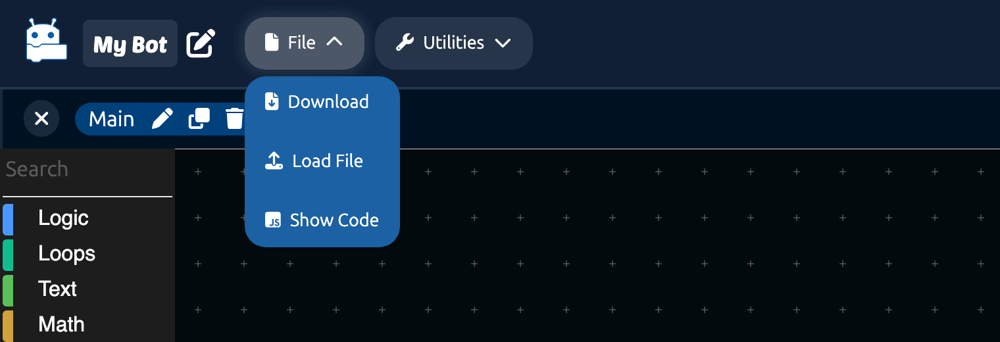
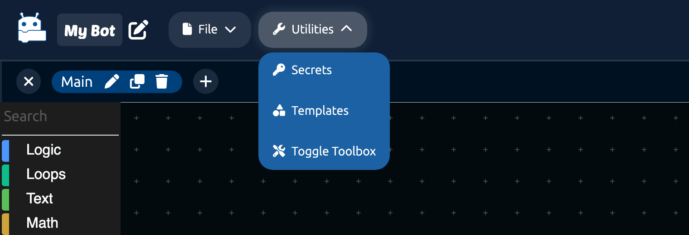
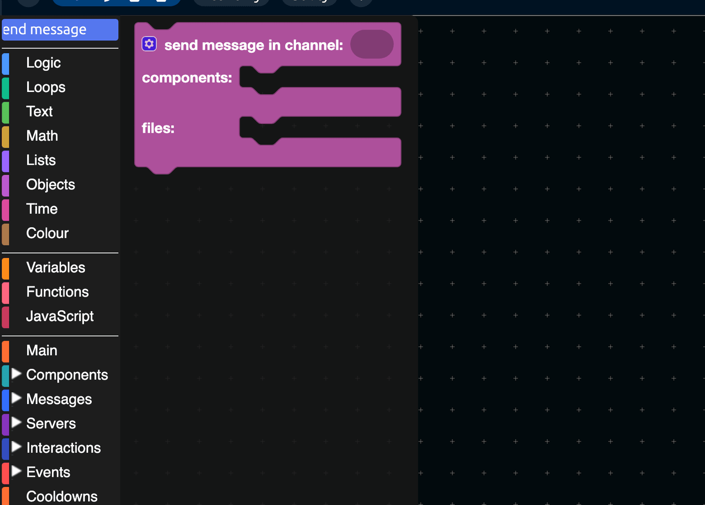
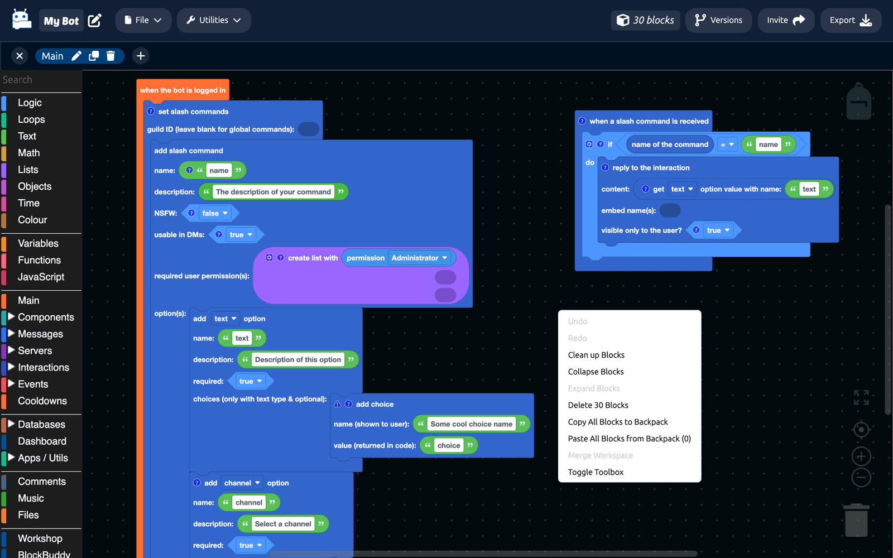
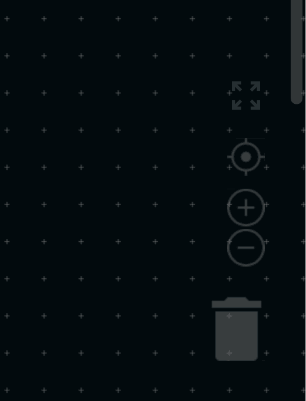
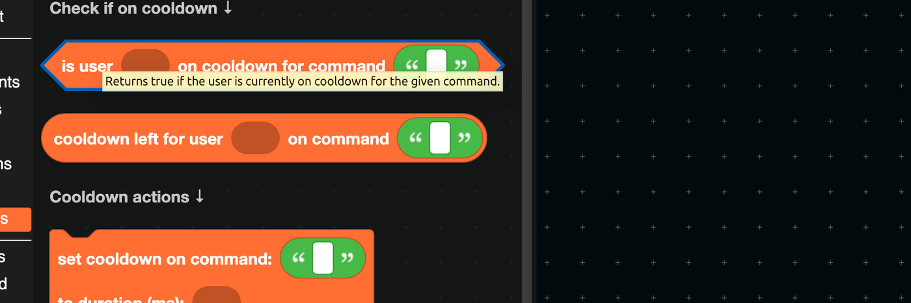
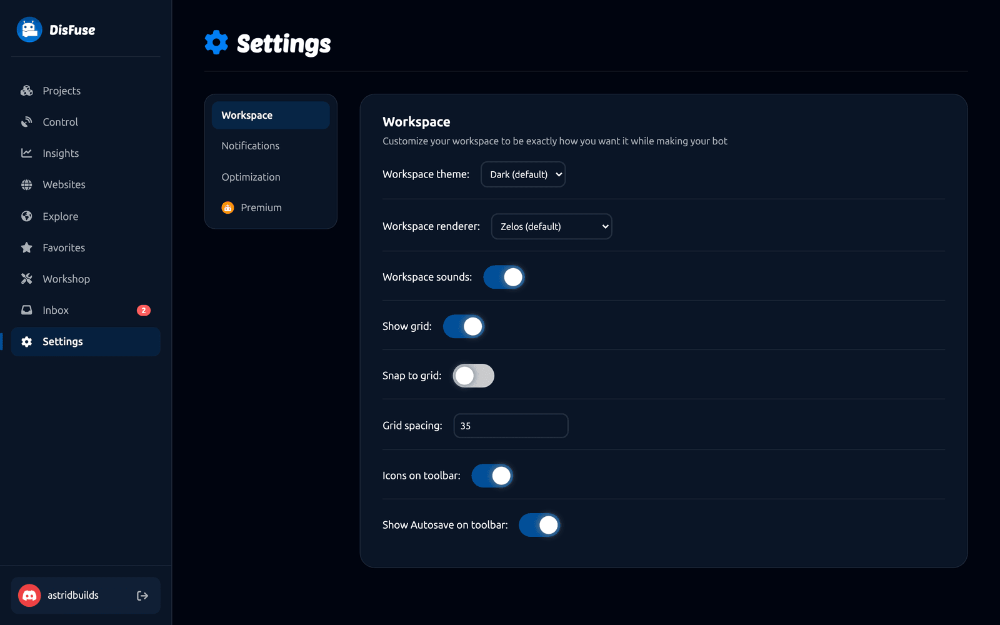

# The Editor

A tour of the workspace: what every part of it does and where to find things.

## The toolbar

Across the top, from left to right:

| Item | What it does |
| --- | --- |
| **DisFuse logo** | Back to your projects. |
| **Project name** | Opens your project's page. The pencil beside it opens [project settings](project-settings.md). |
| **File** | Download the project file, load one, and show the generated code. |
| **Utilities** | Secrets, templates, and hiding the toolbox. |
| **Block count** | How many blocks are in the workspace you are looking at. |
| **Save state** | Saving, saved, reconnecting, or an error. |
| **Versions** | Opens [Version Control](version-control.md). Shows the active version's name. |
| **Invite** | Opens the [collaborators](collaboration.md) panel. |
| **Export** | Downloads your bot as a ZIP. See [Running your bot](running-your-bot.md). |

### The File menu

- **Download** saves the current workspace as a file on your computer, which is a quick manual backup.
- **Load File** brings one back in.
- **Show Code** opens the generated JavaScript.

### The Utilities menu

- **Secrets** opens the [secrets](secrets.md) panel. Owners only.
- **Templates** loads a ready-made block arrangement. See [Templates](templates.md).
- **Toggle Toolbox** hides the toolbox, giving you the full window for the canvas.

## The workspace tabs

Under the toolbar is a tab for each workspace in the project. Click one to switch, the plus to add another, and the pencil or bin on the active tab to rename or delete it. See [Workspaces](workspaces.md).

## The toolbox

The column on the left holds every block, grouped into categories. Click one to open its flyout, then drag a block onto the canvas.

The very top item is **Search**. Click it and type to find a block by its text.

[Using Blocks](../Blocks/using-blocks.md) explains the categories and what the block shapes mean.

## The canvas

Where your blocks live.

| Action | How |
| --- | --- |
| Pan | Drag the empty background, or scroll. |
| Zoom | Scroll with `Ctrl`/`Cmd` held, or use the zoom buttons. |
| Undo and redo | `Ctrl`/`Cmd` + `Z`, and `Ctrl`/`Cmd` + `Shift` + `Z`. |
| Copy and paste | `Ctrl`/`Cmd` + `C`, then `Ctrl`/`Cmd` + `V`. |
| Delete | Drag to the trash can, or select and press `Delete`. |

### Right-click on the canvas

Options for the whole workspace: undo, redo, clean up the layout, collapse or expand every block, delete everything, and move blocks to another workspace.

### Right-click on a block

Options for one block: duplicate, add a comment, collapse, disable, delete, and help.

**Disable** is worth knowing. A disabled block stays where it is but is left out of the exported code, which is the neat way to switch a feature off without losing the work.

### The corner controls

Bottom right: zoom to fit, center, zoom in, zoom out, and the trash can.

Top right is the **backpack**. Drag a block into it to keep a copy, then drag it out in any other project.

## Tooltips

Hover over any block to see what it does, what types it accepts, and what it produces.

Blocks with a question mark icon have longer help, which you open by clicking it.

## Working with other people

If somebody else has the project open, their avatar appears in the toolbar and their cursor and selection show up on the canvas as you both work. See [Collaboration](collaboration.md).

## Making it yours

**Settings > Workspace** in the dashboard changes how the editor looks and behaves: the theme, the block renderer, sounds, and the grid.

See [Settings](../Features/settings.md).
