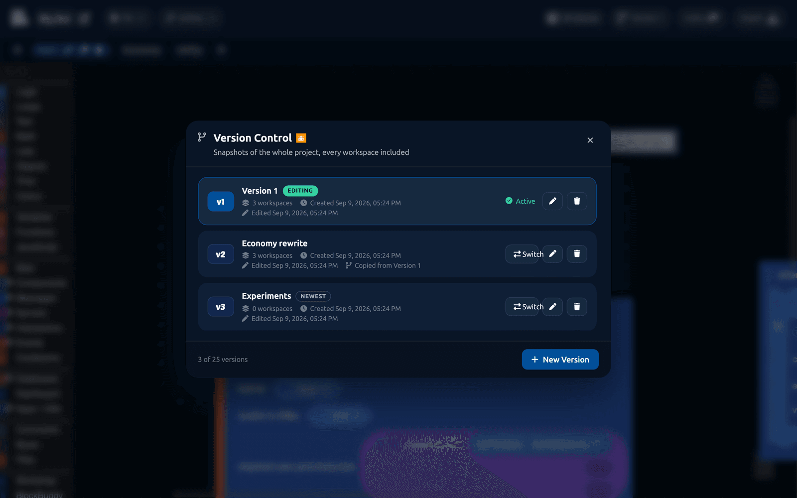

# Version Control

A version is a snapshot of your whole project: every workspace, exactly as it was. You can switch between versions, work on one without touching the others, and come back to a version that worked when a change goes wrong.

:::info
Version Control is a [DisFuse Premium](../Features/premium.md) feature. Versions you have already made stay readable and usable if your subscription ends. You just cannot create new ones.
:::

## Opening it

Click **Versions** in the editor toolbar. Before you have any, the button says "Versions"; once you do, it shows the name of the one you are editing.

## Creating your first version

Click **Create first version**. DisFuse copies your project exactly as it is into Version 1, and from then on the project reads and writes through versions rather than through its own workspaces.

Nothing is lost and nothing changes about how you work. The tab bar, autosave and collaboration all behave the same.

## Creating more

Click **New Version**. You choose where its blocks come from:

| Source | What you get |
| --- | --- |
| **A copy of an existing version** | Everything that version has, as a starting point. |
| **Blank** | No workspaces at all, to build something from scratch. |

Copying is the usual choice. It gives you a safe place to try a rewrite while the version people are actually running stays untouched.

A project can hold up to 25 versions.

## Switching

Click **Switch** on any version. The editor reloads with that version's workspaces, and DisFuse keeps you on the same tab where it can.

The version you are editing is marked **Active**, and its name shows in the toolbar so you always know which one you are changing.

## Renaming and deleting

The pencil renames a version. Names are for you: "Before the economy rewrite" is more useful than "Version 4".

The bin deletes one.

:::warning
Deleting a version deletes its blocks. Nothing else is affected, but that version is gone.

Deleting **every** version puts the project back to having no versions at all, and starts it fresh and empty. Do not delete your last version unless you mean to start over.
:::

## Nothing is shared between versions

Every version holds its own copy of every workspace. Editing Version 2 can never change Version 1. That is the whole point, and it is why a version is safe to experiment in.

Secrets, the bot token, collaborators and project settings belong to the **project**, so they are the same whichever version you are in.

## Exporting a specific version

The export dialog lets you pick which version to export.

This is how you keep a stable version running while building the next one: export the stable one for your host, and keep editing the other.

## How to use it well

- **Take a version before a big change.** Rewriting your economy? Copy the current version first, name it after what it was, and work in the new one.
- **Keep one known-good version.** Whatever you have running on your host, keep a version that matches it, so you can always get back to what works.
- **Name them after what changed**, not when. "Added tickets" tells you more than "v3".
- **Delete versions you will not go back to.** Twenty-five is the limit, and a list of forgotten snapshots is not useful.

## Collaborators and versions

Collaborators can read every version, switch between them, and edit whichever is active. Only the owner can create, rename or delete one.
