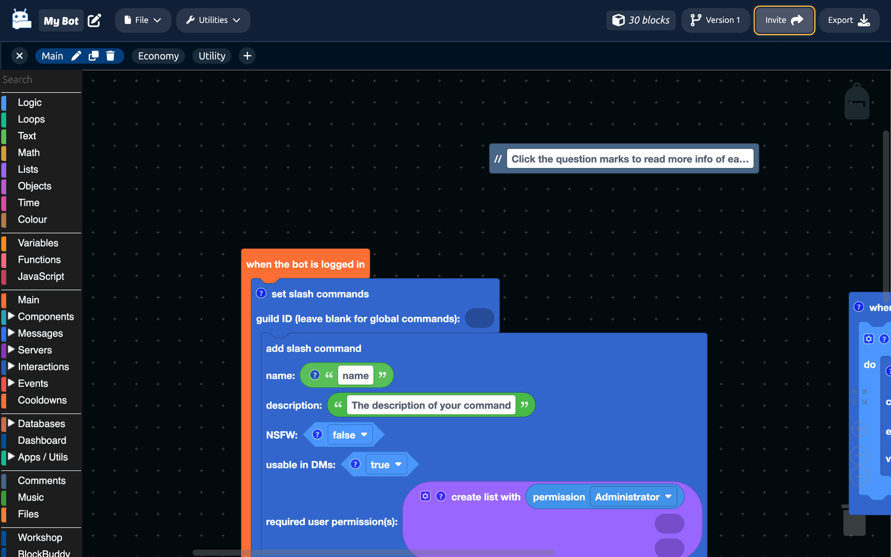

# Workspaces

A project can hold as many workspaces as you like. Each one is a tab with its own canvas, and all of them run as one bot.

Think of them as files in a folder. Splitting a bot across several makes it far easier to find things than scrolling around one enormous canvas.

## Using the tabs

| Action | How |
| --- | --- |
| Switch workspace | Click its tab. |
| Create one | Click the plus at the end of the tab bar. |
| Rename one | Click the pencil on the active tab. |
| Delete one | Click the bin on the active tab. |
| Hide the tab bar | Click the arrow next to the project name. |

:::warning
Deleting a workspace deletes its blocks. There is no undo. Take a [version](version-control.md) first, or download the project with `File > Download`.
:::

## How to split a bot up

There is no right answer, but a split by feature works well:

| Workspace | Holds |
| --- | --- |
| **Main** | The ready event, the presence, and the slash command registration. |
| **Moderation** | Ban, kick, timeout, warnings, the mod log. |
| **Economy** | Balances, daily rewards, the shop. |
| **Welcome** | Join and leave events, autoroles. |
| **Fun** | The commands nobody needs but everybody uses. |

Around five to ten workspaces is comfortable. Beyond that, finding the right tab becomes its own problem.

## What is shared and what is not

**Shared across the whole project:**

- [Secrets](secrets.md)
- The bot token and project settings
- The database file, once created
- [Collaborators](collaboration.md)

**Belongs to one workspace:**

- Blocks
- [Variables](../Blocks/variables.md)
- [Functions](../Blocks/functions.md)

Variables and functions do not cross workspaces. If two workspaces both need a `formatBalance` function, define it in both, or keep everything that needs it in one.

## Moving blocks between workspaces

Right-click a block and choose **Move to workspace**, then pick the destination. The block and everything attached below it moves across.

Right-clicking the empty canvas gives you **Merge workspace**, which brings another workspace's blocks into this one.

## Exporting

When you export, you choose whether to export the whole project or just the workspace you are looking at.

Exporting the whole project is almost always what you want, since a bot built across several workspaces needs all of them.

Exporting a single workspace is for testing one feature on its own.

## Workspaces and versions

If your project uses [Version Control](version-control.md), each version has its own set of workspaces. Switching version switches the tab bar with it, and DisFuse keeps you on the same tab where it can.
