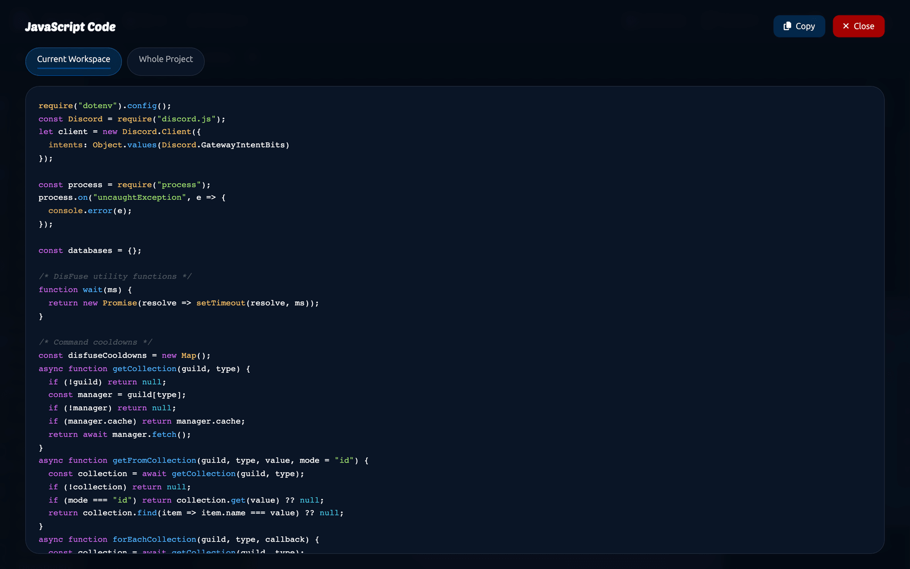

# Troubleshooting

Work through the section that matches your problem. Most of these have one cause.

## The bot will not start

Look at your host's console. The error is almost always in the first few lines.

| Message | Cause | Fix |
| --- | --- | --- |
| `An invalid token was provided` | The token in `.env` is wrong, or was reset in the Discord Developer Portal. | Paste the current token into [project settings](../Guide/project-settings.md) and re-export. |
| `Used disallowed intents` | Privileged intents are off. | Turn on all three in the Developer Portal, under Bot. See [Creating a bot](../Guide/creating-a-bot.md). |
| `Cannot find module 'discord.js'` | Dependencies were not installed. | Run `npm install` in your bot's folder, or let your host do it. |
| `SyntaxError` | A [raw JavaScript](../Blocks/javascript.md) block has broken code in it. | Find it with `File > Show Code`, fix it, re-export. |
| Nothing at all | The host is not running the file. | Set the start command to `node index.js`. |

## The bot is online but does nothing

**Nothing is inside the ready event.** Anything that has to run at startup belongs inside `when the bot is logged in` from [Main](../Blocks/main.md).

**You did not re-export.** Every change needs a new export and a new upload.

**The event needs an intent.** Member events, presence and message content all need a privileged intent switched on.

**The blocks are in a workspace you did not export.** Export the whole project rather than one workspace.

## Slash commands

| Problem | Cause |
| --- | --- |
| Command does not appear | Global registration takes up to an hour. Use a test guild ID while building. |
| Appears but nothing happens | The name in your `if` does not match the registered name. Check for capitals and spaces. |
| "This interaction failed" | You did not reply within 3 seconds. Use `defer reply`. |
| An option is always empty | The name or type in `get option value` does not match the definition. |
| Registration fails | A required option comes after an optional one, or a name has a capital or a space. |

## Messages

**The bot cannot read message content.** `get content of message received` needs the Message Content Intent.

**The bot replies to itself, forever.** Use `when a message is received from a human` instead of `when a message is received`.

**Nothing sends.** Check the bot can see the channel and has Send Messages there. Channel permissions override server permissions.

**The message fails with a components complaint.** A message holds up to 40 components, a row holds 5 buttons or 1 menu, a message holds 5 rows, and containers cannot nest.

## Permissions

Almost every "the block does nothing" problem is a permission problem. Check in this order:

1. Does the bot have the permission **in the server**?
2. Does it have it **in that channel**? Channel overrides win.
3. Is the bot's **role high enough**? A bot cannot manage roles above its own, or moderate somebody whose top role is above the bot's.

`is member bannable by the bot?`, `is member kickable by the bot?` and `channel is manageable by the bot?` let you check before acting.

If your bot is in a server you own, drag its role to the top of the role list and see whether the problem goes away. If it does, it was the hierarchy.

## Databases

**Data disappears on restart.** Your host wipes the filesystem. Check whether it offers persistent storage.

**Nothing is ever found.** The key you write and the key you read are not the same. Log both with `console log` from [JavaScript](../Blocks/javascript.md) and compare them.

**Numbers behave oddly.** Everything comes back as text. Wrap it in `to number`.

**The database block errors immediately.** `create database` has to run before anything reads or writes. Put it inside `when the bot is logged in`.

## Secrets

**Every secret is empty.** Your host ignores `.env` files. Copy each name and value into the host's own environment variable settings.

**One secret is empty.** The name in the block does not match the name in the panel. They are case sensitive.

## The editor

**Blocks will not connect.** The shapes or the types do not match. See [Using blocks](../Blocks/using-blocks.md).

**The workspace is slow.** Turn on Fast block render in [Settings > Optimization](../Features/settings.md), and split the project across [workspaces](../Guide/workspaces.md).

**"Reconnecting" in the toolbar.** Your connection dropped. It reconnects on its own and your changes are held. If it says Error, reload.

**"This project was reopened in this tab".** You opened the project somewhere else. Only one tab at a time.

**Changes are not saving.** Check the toolbar indicator. If it says Error, reload the page; work saved before then is safe.

## Websites

**The site shows nothing.** It is not published. Click Publish in the builder.

**A dashboard setting is always empty in the bot.** The data key in the block does not match the one on the control. They are case sensitive.

**Nobody can change the settings.** Dashboard access is set to owner only. Change it in the Site tab, or ask the server owner to do it.

## Insights

**No events at all.** Re-export. Reporting is written in at export time, so a build from before you had Premium does not report.

**Events stopped.** The bot is offline, or `DISFUSE_INSIGHTS=off` is set in the environment.

## Control

**"Message Content Intent is off".** Turn it on in the Developer Portal and reopen Control.

**A server is missing.** Your bot is not in it, or it is unavailable on Discord's side right now.

**Actions are refused.** Control is your bot, and it obeys the same permissions and the same role hierarchy.

## Reading the generated code

`File > Show Code` shows the JavaScript your blocks produce.

You do not need to understand it. It is useful for confirming a block produced what you expected, and for showing somebody in the support channel exactly what is happening.

## Asking for help

[Join the DisFuse Discord server](https://dsc.gg/disfuse) and post in the support channel with:

1. What you expected to happen
2. What actually happened
3. A screenshot of the relevant blocks
4. The error from your host's console, if there is one

That is nearly always enough for somebody to spot the problem straight away.
