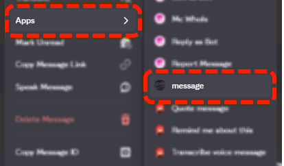
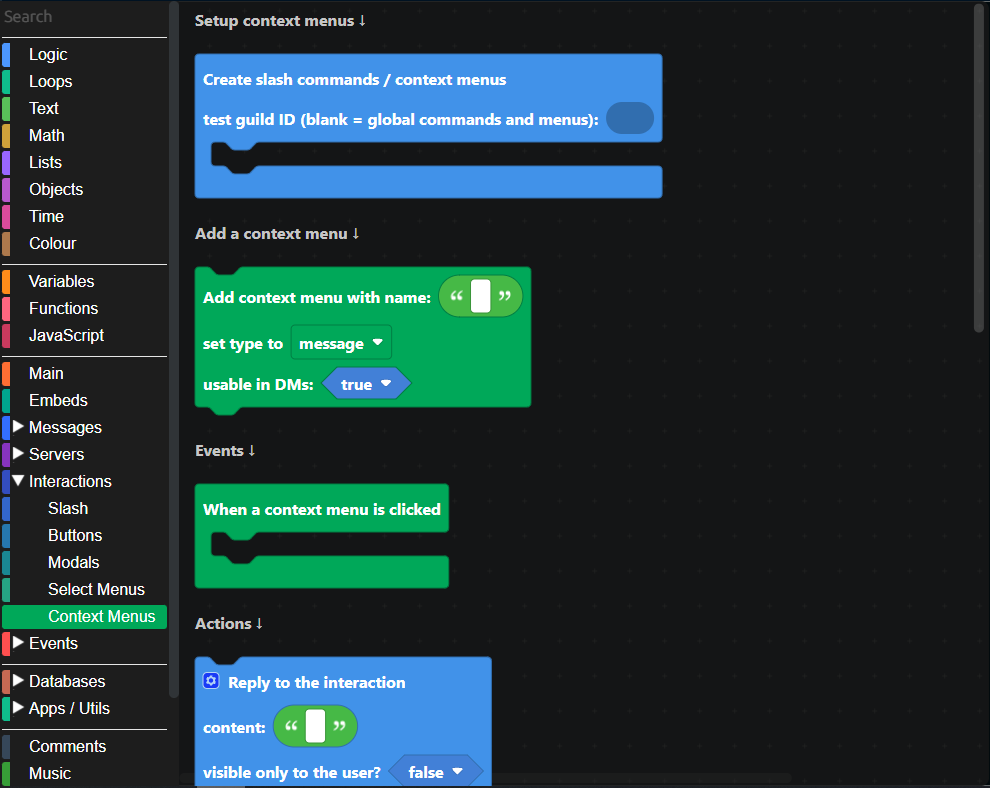
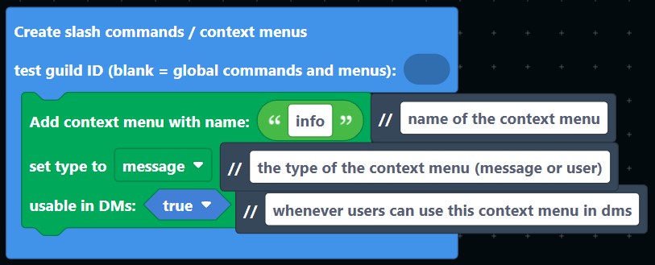
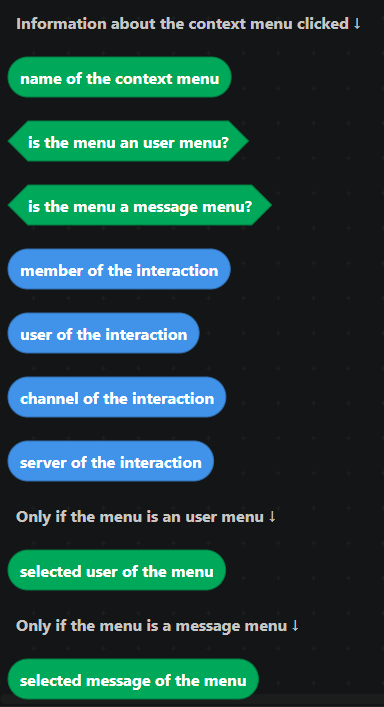
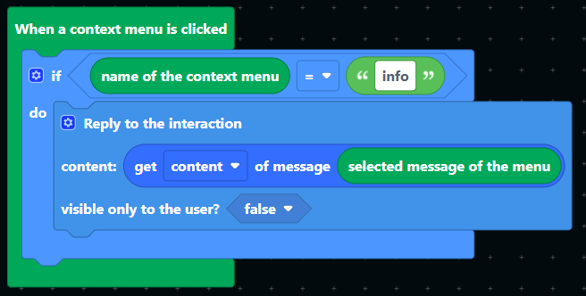
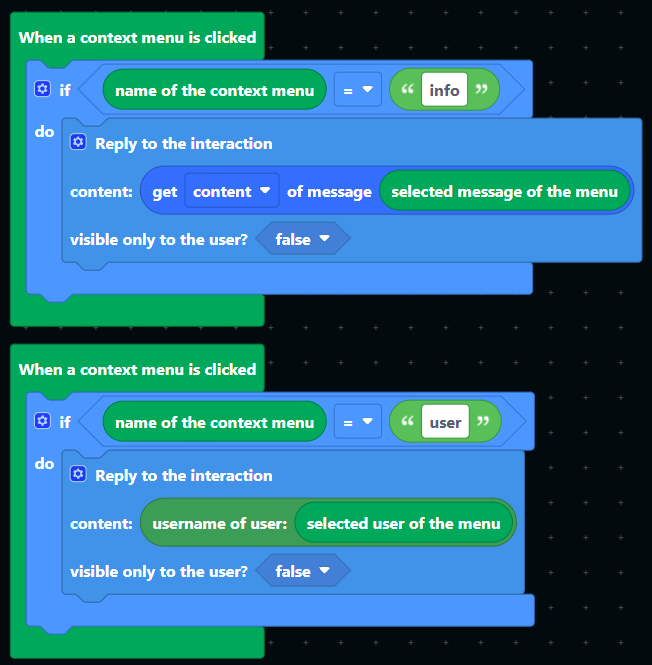

# Context Menus

## What are Context Menus?

Context Menus are another way for users to interact with your Discord bot, without typing any commands.
Instead of entering text, users can right-click (or tap the menu button on mobile) on a user or a message and choose an action from a special bot-provided menu.

Context Menus are useful for quick actions, for example:

* "Report User" from a user's profile
* "Translate Message" from a message
* "Give Points" directly to a user
* "Pin to Channel" for a specific message

There are two types of Context Menus:

* User Context Menus: show up when you right-click on a user's name or avatar.
* Message Context Menus: show up when you right-click on a message in a channel.

Unlike Slash Commands, you don't need to type anything, the menu sends the selection to your bot, and your bot runs the corresponding logic.
You can also still pass along useful parameters automatically, like the ID of the selected user or message, so your bot knows exactly what to act on.

## Context Menus in DisFuse

Under the "interactions" tab, there is the "Context Menus" category. All Context Menu related blocks are here.

To create Context menus, use the "Create slash commands / context menus" block.

If you want the Context Menus to only be available in a certain server, put the ID of the server in the "test guild" field.

_This is recommended while testing._

## Recieving Context Menus

To respond to Context Menus, use the `When a context menu is clicked` event block. You can get the following information from the executed command:

Since the `When a context menu is clicked` block triggers whenever ANY Context Menu is run, you should use the `if` block to check if the Context menu is the one you want to respond to.

You can have multiple `When a context menu is clicked` blocks, each checking for a different Context Menu.

Once the Context Menu has finished executing, you should also reply to the Context Menu directly with the `Reply to the interaction` block.

:::tip
You can load the `context menu` template into your own project to automatically get a basic setup for slash commands.

Click `Utilities > Templates` in the top bar, then select the `context menu` template.
:::

You now know how to create basic Context Menus! If you need any help, or want to know how to do more advanced things, feel free to explore the other available blocks or [join our Discord server](https://dsc.gg/disfuse) for help.
