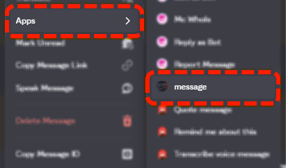
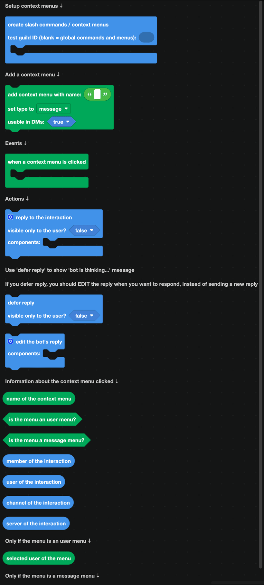
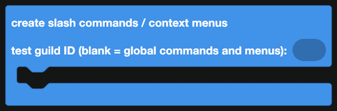
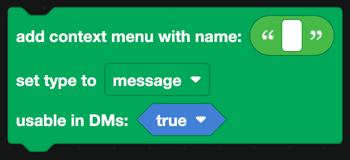
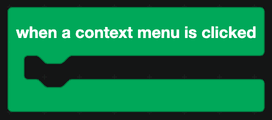

# Context Menus

A context menu is an action your bot adds to Discord's right-click menu. No typing, no command name: right-click a user or a message, open **Apps**, and pick what you want.

They suit quick actions on something specific:

- "Report User" from a profile
- "Translate Message" from a message
- "Give Points" to a member
- "Pin to Channel" for a message

## The two types

- **User context menus** appear when you right-click a member's name or avatar.
- **Message context menus** appear when you right-click a message.

Discord tells your bot which user or message was clicked, so there is nothing for the person to fill in.

## The Context Menus category

  
Show the whole Context Menus flyout

## Registering a context menu

Context menus are registered with the same block as slash commands, inside `when the bot is logged in` from [Main](../Blocks/main.md). Leave the test guild ID blank for global, or set it while testing.

`add context menu` defines one.

| Field | What it is |
| --- | --- |
| Name | What people see in the Apps menu. Spaces and capitals are allowed here. |
| Type | `message` or `user`. |
| Usable in DMs | Whether it works outside a server. |

:::info
A context menu has no description and no options. The name is the whole interface, so make it short and say exactly what it does.
:::

## Responding

`when a context menu is clicked` fires for every context menu on your bot, so check which one first.

`name of the context menu` gives you the name you registered.

### What was clicked

| Block | Returns |
| --- | --- |
|  | True when a user menu was used. |
|  | True when a message menu was used. |
|  | The user that was right-clicked. User menus only. |
|  | The message that was right-clicked. Message menus only. |

Plus the four blocks every interaction has:

| Block | Returns |
| --- | --- |
|  | The member who used the menu. |
|  | The user who used it. |
|  | The channel it happened in. |
|  | The server it happened in. |

:::warning
`selected user of the menu` is only filled in for user menus, and `selected message of the menu` only for message menus. Check the type first if one handler covers both.
:::

## Replying

The same three blocks as everywhere else: `reply to the interaction`, `defer reply` for slow work, and `edit the bot's reply` afterwards. See [Interactions](interactions.md).

Most context menu actions should reply with **visible only to the user** turned on. The person right-clicked something quietly; a public reply is rarely what they wanted.

## Limits

Discord allows 5 user context menus and 5 message context menus per bot. Choose them carefully.

## A worked example: a report action

1. Register a **message** context menu named `Report Message`.
2. In `when a context menu is clicked`, check the name.
3. `selected message of the menu` gives you the message.
4. Send a message to your staff channel with the content, the author, a link to the channel, and who reported it.
5. `reply to the interaction`, visible only to the user, with "Thanks, the staff team has been notified."

:::tip
DisFuse ships a **Context Menu** template with a working setup. Click `Utilities > Templates` in the editor toolbar. See [Templates](../Guide/templates.md).
:::
