# Modals

A modal is a pop-up form. Your bot shows it, the user fills it in, and your bot receives everything they entered at once. It is the right tool whenever a slash command would need more than two or three options, or when the answer should stay private.

  
Show the whole Modals flyout

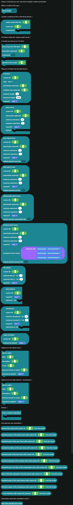

:::warning
A modal can only be shown **in response to an interaction**: a slash command, a button click, a select menu, or a context menu. It cannot be shown from a message event or on a timer.

A modal also cannot be shown in response to another modal, and it cannot be shown after you have already replied or deferred.
:::

## Showing a modal

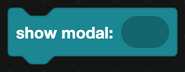

`show modal` displays it. This is your response to the interaction, so do not reply or defer before it.

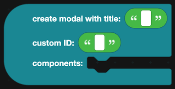

`create modal with title ... custom ID ... components ...` builds the form. The **custom ID** is how you recognize the submission later.

## Building the form

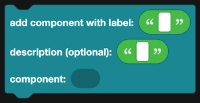

`add component with label` is the wrapper around every input. It gives the field its label and an optional description, and holds the input itself.

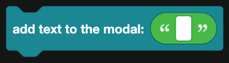

`add text to the modal` adds a paragraph of explanation with no input attached.

A modal holds up to 5 of these.

## The inputs

Plug one of these into a label block.

| Block | What the user does |
| --- | --- |
| 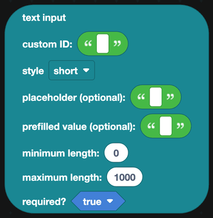 | Types text. Short for one line, paragraph for many. |
| 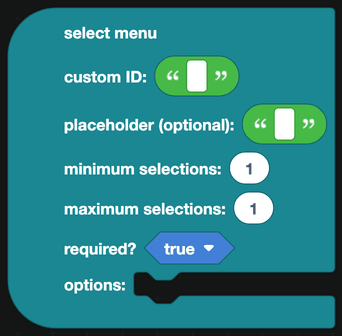 | Picks from options you define. |
| 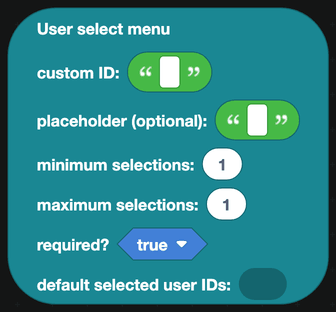 | Picks members. |
| 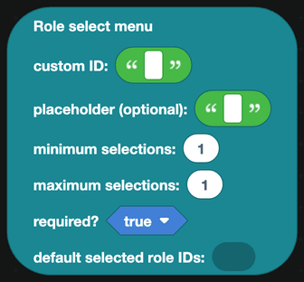 | Picks roles. |
| 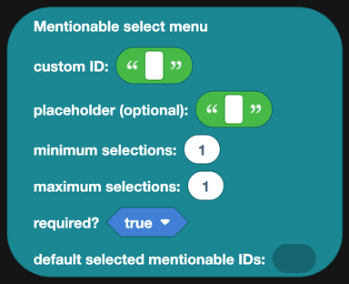 | Picks members or roles. |
| 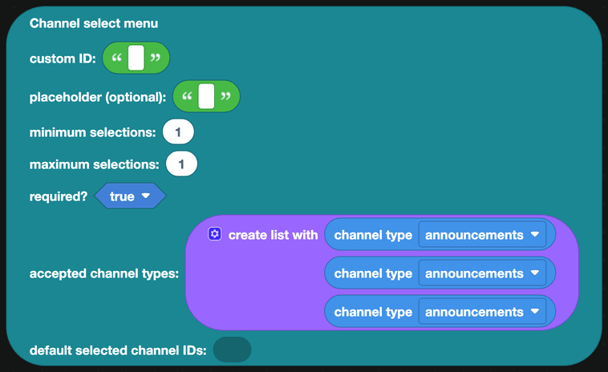 | Picks channels. Restrict the kinds with `channel type` blocks. |
| 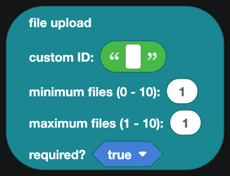 | Uploads between 1 and 10 files. |
| 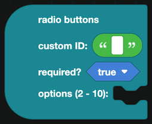 | Picks exactly one of 2 to 10 choices. |
| 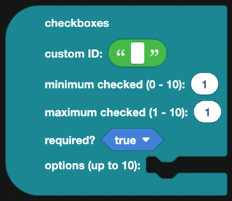 | Ticks any number of choices. |
| 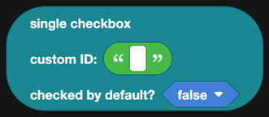 | Ticks one box, for a yes or no. |

Every input has a **custom ID**, which is how you read its value back. They have to be unique within the modal.

### Options

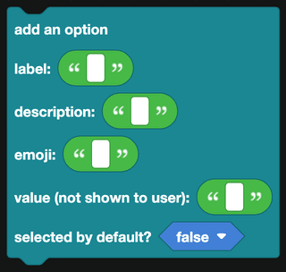

`add an option` fills a select menu: label, description, emoji, value, and whether it starts selected.

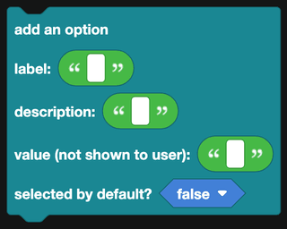

`add an option` for radio buttons and checkboxes: label, description, value, and whether it starts selected.

## Handling the submission

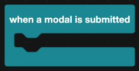

`when a modal is submitted` fires for every modal your bot shows, so check the custom ID first.

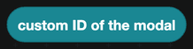
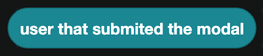

`custom ID of the modal` and `user that submited the modal` tell you which form came back and who sent it.

### Reading the values

Each input type has its own block. Give it the custom ID you set on the input.

| Block | Returns |
| --- | --- |
| 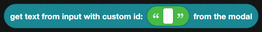 | The text from a text input. |
| 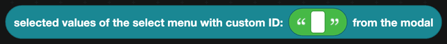 | The values chosen in a select menu. |
| 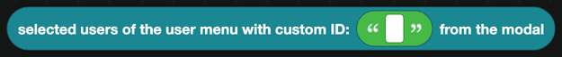 | The users chosen. |
|  | The same people, as members of the server. |
| 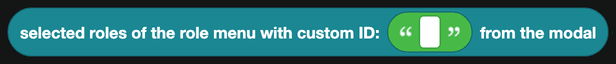 | The roles chosen. |
| 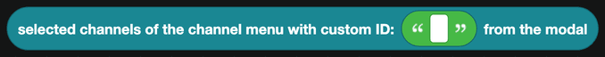 | The channels chosen. |
| 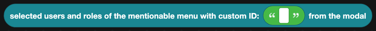 | The users and roles chosen. |
| 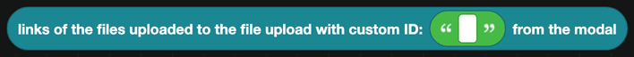 | Links to the files uploaded. |
|  | The value of the radio button chosen. |
| 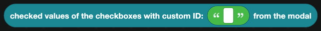 | The values of the boxes ticked. |
| 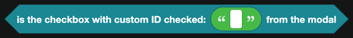 | True when the box was ticked. |

Most of these return a list, so read them with the [Lists](../Blocks/lists.md) blocks.

## Replying

A modal submission is an interaction like any other, and it has the same 3 second limit. Use `reply to the interaction`, or `defer reply` and then `edit the bot's reply`.

## A worked example: a suggestion form

1. Register a slash command `suggest` with no options.
2. In the handler, `show modal` with `create modal`:
   - title "New suggestion", custom ID `suggestion_form`
   - a label "Title" holding a short text input, custom ID `title`
   - a label "Details" holding a paragraph text input, custom ID `details`
   - a label "Category" holding a select menu, custom ID `category`, with options for Feature, Bug and Other
3. In `when a modal is submitted`:
   - Check the custom ID is `suggestion_form`.
   - Read the three values.
   - Send a message to your suggestions channel with a container holding the title, the category and the details.
   - React to it with 👍 and 👎.
   - Reply, visible only to the user, with "Thanks, your suggestion has been posted."

:::tip
Modals are much friendlier than a slash command with six options. The user sees labels and descriptions, and nothing they type is visible in the channel while they type it.
:::
