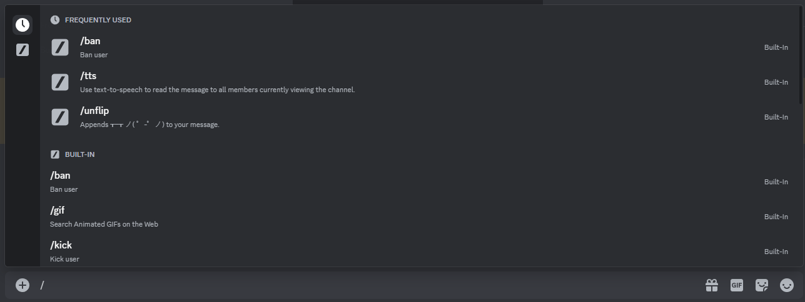
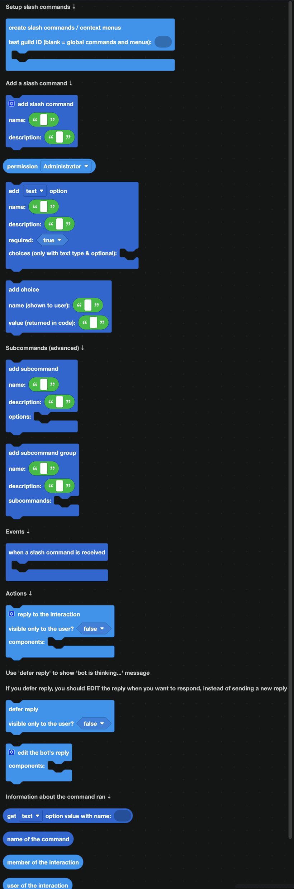
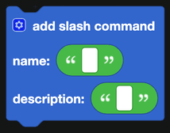
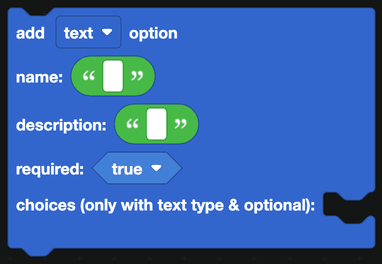
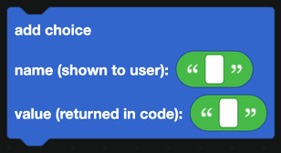
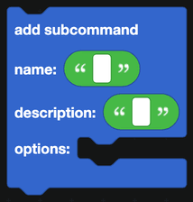
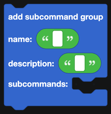
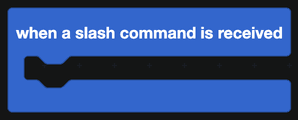
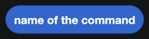
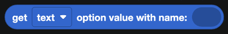

# Slash Commands

Slash commands are the main way people talk to a Discord bot. Type `/` in any channel and Discord lists what is available.

A command can take **options**, which are the values the user fills in: `/ban <user> <reason>`. It can also have **subcommands**, so `/balance show` and `/balance leaderboard` both live under `/balance`.

## The Slash category

All the slash command blocks are under **Interactions**, then **Slash**.

  
Show the whole Slash flyout

## Registering commands

`create slash commands / context menus` registers everything inside it with Discord. Put it inside `when the bot is logged in` from [Main](../Blocks/main.md).

Leave **test guild ID** blank for global commands, or put a server ID in it while you are testing so changes appear straight away.

`add slash command` defines one command. It goes inside the block above.

| Field | What it is |
| --- | --- |
| Name | The command name. Lowercase, no spaces. |
| Description | The line Discord shows next to it in the menu. |
| NSFW | Whether the command is age restricted. |
| Usable in DMs | Whether it works outside a server. |
| Required user permission(s) | Permissions the user must have for Discord to show them the command. |

Click the gear on the block to reveal the extra fields, including options and subcommands.

`permission ...` is one permission. Put several inside a `create list with` block from [Lists](../Blocks/lists.md).

:::tip
Setting required permissions on the command is better than checking inside the handler. Discord hides the command from anyone who is not allowed to use it, so they never see it in the first place. Check inside the handler too if the consequences of the command are serious.
:::

## Options

`add ... option` adds one value the user fills in. The dropdown chooses its type:

| Type | The user picks |
| --- | --- |
| Text | Anything they type |
| Integer | A whole number |
| Number | A number, decimals allowed |
| Boolean | True or false |
| User | A member, from a picker |
| Role | A role |
| Channel | A channel |
| Mentionable | A user or a role |
| Attachment | A file they upload |

Required options must come before optional ones. Discord rejects the registration otherwise.

### Choices

For a text or number option, `add choice` gives the user a fixed list to pick from instead of free typing. The **name** is what they see, the **value** is what your code receives.

## Subcommands

`add subcommand` groups related actions under one command name. `/settings prefix` and `/settings welcome` are two subcommands of `/settings`.

`add subcommand group` nests one level deeper: `/settings channels welcome`.

:::warning
A command with subcommands cannot also have its own options. Move the options onto the subcommands.
:::

## Responding to a command

`when a slash command is received` fires for every slash command your bot has, so check which one first.

`name of the command` gives you the command name.

`get ... option value with name ...` reads an option. The dropdown must match the type you defined, and the name must match exactly.

Plus the four blocks every interaction has:

| Block | Returns |
| --- | --- |
|  | The member who ran the command. |
|  | The user who ran it. |
|  | The channel it was run in. |
|  | The server it was run in. |

## Replying

`reply to the interaction` answers the command. Build the message in the **components** input, using the [Components](../Blocks/Components/components.md) blocks. Turn on **visible only to the user** for a reply nobody else sees.

Every command must reply, or defer, within 3 seconds. For anything slow:

`defer reply` first, then `edit the bot's reply` when the work is done.

## A worked example: a ban command

1. In `when the bot is logged in`, add `create slash commands / context menus` with your test server's ID.
2. Inside it, `add slash command`:
   - name `ban`, description "Ban a member from the server"
   - required user permission: Ban Members
   - a **user** option named `user`, required
   - a **text** option named `reason`, not required
3. In `when a slash command is received`:
   - `if` `name of the command` equals `ban`
   - `get user option value with name user` gives you the target
   - Check `is member bannable by the bot?` from [Members](../Blocks/Servers/members.md)
   - `ban member` with the reason
   - `reply to the interaction` confirming it

:::tip
DisFuse ships a **Slash Commands** template with a working setup already built. Click `Utilities > Templates` in the editor toolbar to load it. See [Templates](../Guide/templates.md).
:::

## Troubleshooting

| Problem | Cause |
| --- | --- |
| The command does not appear | Global commands take up to an hour. Use a test guild ID while building. |
| It appears but does nothing | The name in your `if` does not match the registered name. |
| "This interaction failed" | You did not reply within 3 seconds. Defer first. |
| An option is always empty | The option name or type in `get option value` does not match the definition. |
| The registration fails | A required option comes after an optional one, or a name has a capital letter or a space. |

If you are still stuck, [join the DisFuse Discord server](https://dsc.gg/disfuse) and post a screenshot of your blocks.
