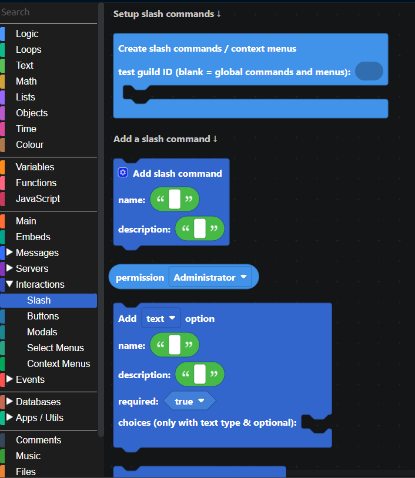

# Slash Commands

## What are Slash Commands?

Slash Commands are the main method of communicating with Discord bots.
Users can run commands on a Discord bot to interact with it.

Users can type "/" in the chat to see the list of available commands.

You can use slash commands to allow your users to do things, e.g. /kick, /ban, etc.

You can also add **options** within slash commands, like channel options, user options, text options, etc. This allows users to specify parameters for a command and the bot can use those parameters. For example, `/ban <user> <reason>`. You can also add **subcommands** to a command. Like: `/balance show` and `/balance leaderboard` both fall under the `/balance` command.

## Slash commands in DisFuse

Under the "interactions" tab, there is the "Slash" category. All slash command related blocks are here.

To create Slash commands, use the "Create slash commands / context menus" block.

If you want the commands to only be available in a certain server, put the ID of the server in the "test guild" field.

_This is recommended while testing._

You can also choose to add options to your slash commands with the `add \_\_ option` block.

These are the types of options you can have:

- Text option

- User

- Role

- Boolean (true/false)

- Channel

- Integer

- Mentionable (role or user)

- Number (can include decimals)

- Attachment (file)

:::info
For text options, you can specify certain "choices" to choose from, instead of the user having to type out the whole thing.

:::

## Recieving slash commands

To respond to slash commands, use the `when a slash command is recieved` event block. You can get the following information from the executed command:

Since the `when a slash command is received` block triggers whenever ANY slash command is run, you should use the `if` block to check if the command is the one you want to respond to.

You can have multiple `when a slash command is received` blocks, each checking for a different command.

Once the command has finished executing, you should also reply to the command directly with the `reply to the interaction` block.

:::tip
You can load the `slash commands` template into your own project to automatically get a basic setup for slash commands.

Click `Utilities > Templates` in the top bar, then select the `slash commands` template.
:::

You now know how to create basic slash commands! If you need any help, or want to know how to do more advanced things, feel free to explore the other available blocks or [join our Discord server](https://dsc.gg/disfuse) for help.
